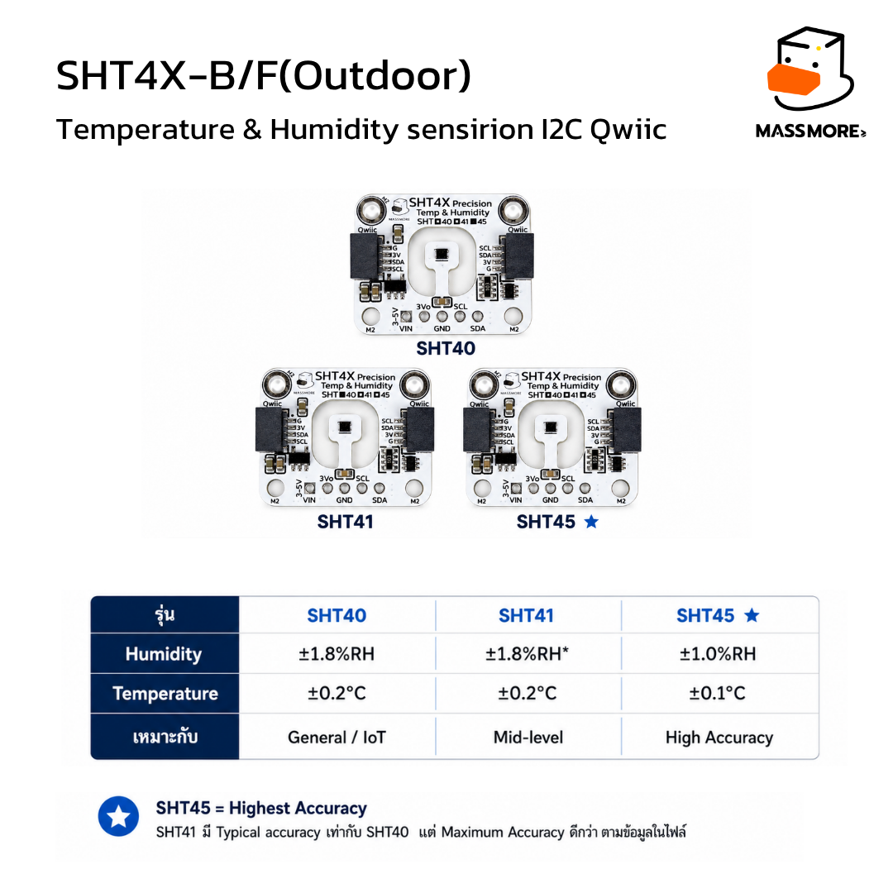
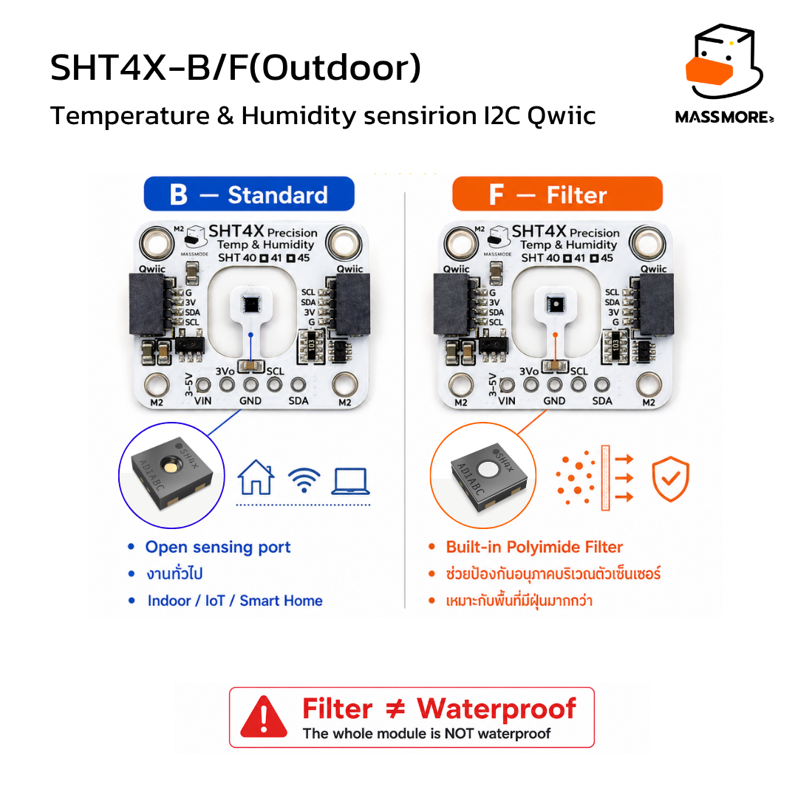
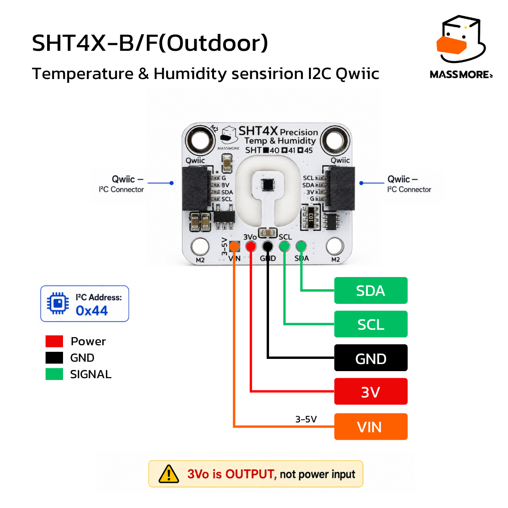

<div align="center">


# Massmore_SHT4x

**Arduino / PlatformIO driver for the Massmore SHT4X Temperature & Humidity Sensor (SKU-1022)**
Sensirion SHT40 · SHT41 · SHT45 — standard (-B) and Outdoor membrane (-F) versions

[](LICENSE)
[](ArduinoIDE/Massmore_SHT4x/library.properties)
[](#mcu-compatibility--limitation-matrix)

</div>

---

## Product Overview

บอร์ดเซ็นเซอร์วัดอุณหภูมิและความชื้นความแม่นยำสูง ใช้ชิป **Sensirion SHT4x** ของแท้
ออกแบบและผลิตโดย Massmore — *Designed and Manufactured by Massmore*

<div align="center">

</div>

| Item | Spec |
|---|---|
| Sensor | Sensirion SHT40 / SHT41 / SHT45 (เลือกรุ่นตอนสั่งซื้อ ดูช่องติ๊กบน silkscreen) |
| Interface | I2C (max 1 MHz), address **0x44** (fixed, ไม่มีขา ADDR) |
| Temperature | −40 … +125 °C, accuracy ±0.2 °C (SHT40/41) · ±0.1 °C (SHT45) |
| Humidity | 0 … 100 %RH, accuracy ±1.8 %RH (SHT40/41) · ±1.0 %RH (SHT45) |
| Measurement time | 1.3 ms (low) · 3.7 ms (medium) · 6.9 ms (high precision) |
| Heater | 200 / 110 / 20 mW × 1 s / 0.1 s (6 modes, duty cycle < 10 %) |
| Supply | VIN 3 – 5 V ผ่าน 3.3 V LDO on-board, มี **3Vo** output 3.3 V |
| Pull-up | 10 kΩ on SDA / SCL (on-board) |
| Connector | Qwiic-compatible 4-pin JST-SH × 2 (daisy-chain ได้) + 5-pin header 2.54 mm |
| Package | -B: open cavity (ตอบสนองเร็ว) · -F: Polyimide membrane กันฝุ่น/ละอองน้ำ (Outdoor) |
| Board size | 25.40 × 20.32 mm, M2 mounting holes |

<div align="center">

</div>

---

## Pinout Table

<div align="center">

</div>

| Pin | Function | Notes |
|---|---|---|
| **VIN** | Power input | 3 – 5 V (ต่อ 3V3 หรือ 5V ของ MCU ได้) |
| **3Vo** | 3.3 V output | **OUTPUT เท่านั้น** ห้ามจ่ายไฟเข้า ใช้เลี้ยงอุปกรณ์ 3.3 V ตัวเล็กได้ |
| **GND** | Ground | — |
| **SCL** | I2C clock | มี pull-up 10 kΩ, ระดับ 3.3 V |
| **SDA** | I2C data | มี pull-up 10 kΩ, ระดับ 3.3 V |
| **Qwiic ×2** | I2C + 3.3 V | สาย Qwiic / STEMMA QT ต่อได้โดยตรง, พ่วงต่อไปบอร์ดอื่นได้ |

> ⚠️ ขา SDA/SCL เป็นระดับ 3.3 V — ใช้กับ Arduino Nano (5 V logic) ได้เพราะ SHT4x รับ input high ≥ 0.7·VDD และ Nano อ่าน 3.3 V เป็น HIGH แต่ **ห้าม** จ่าย 5 V เข้าขา 3Vo

---

## MCU Compatibility & Limitation Matrix

| MCU Platform | Tested Core / Toolchain | Bus Remapping Support | Limitations / Notes |
|---|---|---|---|
| **ESP32-S3** | Arduino-ESP32 v3.x+ (pioarduino 55.03.311 / Core 3.3.11) | Full GPIO Matrix (`Wire`, `Wire1`) | None. Recommended for high-rate data. Default `Wire` pins SDA 8 / SCL 9. |
| **ESP32 (Classic)** | Arduino-ESP32 v3.x+ (pioarduino 55.03.311 / Core 3.3.11) | Full GPIO Matrix (`Wire`, `Wire1`) | None. **Primary Factory Test target** (SDA 21 / SCL 22). |
| **AVR — Arduino Nano (ATmega328P)** | Arduino AVR Core (atmelavr 5.3.0) | Fixed Hardware Pins (I2C: A4 / A5) | 2 KB SRAM / 32 KB Flash. ใช้ได้ทั้ง Simple API และ FSM (`01_BasicRead` ใช้ RAM 625 B / Flash 7.9 KB, `05_Factory_Test` ใช้ RAM 1010 B / Flash 14.4 KB). 5 V logic — ต่อ VIN → 5V ได้เลย บอร์ดรับ 5 V |

RP2040 / STM32: ไลบรารีไม่มีโค้ดเฉพาะ platform จึงน่าจะ compile ได้ แต่ **ไม่ได้ทดสอบและไม่รับประกัน**

---

## Installation

**Arduino IDE**

1. ดาวน์โหลด [`ArduinoIDE/Massmore_SHT4x.zip`](ArduinoIDE/Massmore_SHT4x.zip)
2. *Sketch → Include Library → Add .ZIP Library…* เลือกไฟล์ที่โหลดมา
3. *File → Examples → Massmore_SHT4x → 01_BasicRead*

ESP32 ต้องติดตั้ง **esp32 by Espressif Systems v3.x** ใน Boards Manager

**PlatformIO (VS Code)**

1. เปิดโฟลเดอร์ [`PlatformIO/`](PlatformIO/) ใน VS Code (มี PlatformIO IDE extension)
2. เลือก env (`esp32dev` / `esp32-s3-devkitc-1` / `nano`) แล้วกด **Build / Upload**
3. ไม่ต้องติดตั้งอะไรเพิ่ม — platform ถูก pin ไว้ให้เป็น pioarduino (Core 3.x) และไลบรารีอยู่ใน `lib/` แล้ว

---

## Quick Start Code

```cpp
#include <Massmore_SHT4x.h>

Massmore_SHT4x sensor;   // ใช้ Wire

void setup() {
  Serial.begin(115200);
#if defined(ESP32)
  Wire.begin(21, 22);    // sketch เป็นเจ้าของ Bus: SDA, SCL
#else
  Wire.begin();          // AVR: A4 / A5
#endif
  if (!sensor.begin()) { // address 0x44
    Serial.println(sensor.lastErrorString());
    while (true) delay(1000);
  }
}

void loop() {
  float t, h;
  if (sensor.readAll(t, h)) {
    Serial.print(t); Serial.print(" C  ");
    Serial.print(h); Serial.println(" %RH");
  }
  delay(1000);
}
```

---

## Pin Mapping Examples

<div align="center">

</div>

**ESP32 Classic — custom GPIO (Core 3.x)**

```cpp
Wire.begin(21, 22);          // SDA, SCL (เปลี่ยนเป็นขาไหนก็ได้)
Wire.setClock(400000);
sensor.begin();
```

**ESP32-S3 — second bus `Wire1` on custom GPIO**

```cpp
Wire1.begin(17, 18);         // SDA, SCL
Massmore_SHT4x sensor(Wire1);
sensor.begin();
```

**Arduino Nano (ATmega328P) — fixed hardware pins**

```cpp
Wire.begin();                // SDA = A4, SCL = A5 (เปลี่ยนไม่ได้)
sensor.begin();              // VIN -> 5V, GND -> GND
```

---

## API Reference

ทุก enum / struct อยู่ใน class: `Massmore_SHT4x::Precision::HIGH_RES`, `Massmore_SHT4x::Readings` ฯลฯ

| Function | Description | Return |
|---|---|---|
| `Massmore_SHT4x(TwoWire &wire = Wire)` | สร้างอ็อบเจกต์ ระบุ I2C Bus | — |
| `begin(addr = 0x44, variant = UNKNOWN)` | เริ่มใช้งาน: ACK → soft reset → อ่าน Serial Number | `bool` |
| `begin(TwoWire &wire, addr, variant)` | เหมือนด้านบน พร้อมเปลี่ยน Bus | `bool` |
| `isConnected()` | ชิป ACK บน Bus หรือไม่ | `bool` |
| **Simple Blocking API** | | |
| `readTemperature(precision)` | วัดแล้วคืนอุณหภูมิ | `float` °C หรือ `NAN` |
| `readHumidity(precision)` | วัดแล้วคืนความชื้น | `float` %RH หรือ `NAN` |
| `readAll(Readings&, precision)` | วัดครั้งเดียวได้ทั้งสองค่า + raw + timestamp | `bool` |
| `readAll(float &t, float &h, precision)` | วัดครั้งเดียว รูปแบบ float | `bool` |
| **Non-blocking FSM** | | |
| `requestConversion(precision)` | สั่งวัดแล้วคืนทันที | `bool` |
| `requestHeater(mode)` | สั่ง Heater แล้วคืนทันที | `bool` |
| `update()` | ขับ FSM เรียกทุกรอบ `loop()` | `bool` มีผลใหม่ |
| `isDataReady()` / `getReadings(Readings&)` | มีผลใหม่หรือไม่ / รับผล | `bool` |
| `getState()` | `IDLE` / `MEASURING` / `HEATING` / `DATA_READY` | `State` |
| **Heater** | | |
| `runHeater(mode, Readings* = nullptr)` | ยิง Heater 1 pulse (Blocking) | `bool` |
| `setHeaterDutyGuard(bool)` | เปิด/ปิด guard 10 % duty cycle (default เปิด) | — |
| `heaterCooldownRemainingMs()` | ต้องรออีกกี่ ms ก่อนยิงครั้งถัดไป | `uint32_t` |
| **Identity** | | |
| `verifyChipID()` | ยืนยันชิปด้วย Serial Number + CRC (SHT4x ไม่มี CHIP_ID register) | `bool` |
| `getSerialNumber()` / `readSerialNumber(uint32_t&)` | Serial Number 32-bit จากโรงงาน | `uint32_t` / `bool` |
| `isGenuine()` | heuristic 9 ข้อตาม datasheet (~50 ms) | `bool` |
| `getGenuineMask()` / `genuineCheckName(i)` | ผลรายข้อ | `uint16_t` / `const char*` |
| **Config / misc** | | |
| `setTemperatureOffset(°C)` / `setHumidityOffset(%RH)` | ชดเชยค่า | — |
| `setVariant(v)` / `getVariantName()` | ระบุรุ่นตาม silkscreen | — / `const char*` |
| `softReset()` / `generalCallReset()` | reset ชิป / reset ทุกตัวบน Bus | `bool` |
| `dewPoint(t,h)` / `absoluteHumidity(t,h)` / `heatIndex(t,h)` | ค่าคำนวณต่อ (static) | `float` |
| `lastError()` / `lastErrorString()` | `ErrorCode` ล่าสุด | `ErrorCode` / `const char*` |
| `scan(TwoWire&, uint8_t *found)` | หา SHT4x ที่ 0x44/45/46 (static) | จำนวนที่พบ |

`ErrorCode`: `OK, NOT_BEGUN, NOT_FOUND, WRONG_ID, TIMEOUT, CRC_FAIL, BUS_ERROR, NOT_READY, BUSY, BAD_ARG, HEATER_DUTY`

---

## Examples

| # | Example | Description |
|---|---|---|
| 01 | `01_BasicRead` | Simple Blocking API อ่านค่าทุก 1 วินาที |
| 02 | `02_CustomPins_BusRemap` | ESP32 Core 3.x ย้ายขา SDA/SCL + ใช้ `Wire1`; AVR ใช้ A4/A5 |
| 03 | `03_NonBlocking_Multitask` | FSM API พร้อมกะพริบ LED แสดงว่า `loop()` ไม่ถูก Block |
| 04 | `04_Heater_DewPoint` | Heater 6 โหมด + duty guard, dew point / absolute humidity / heat index |
| 05 | `05_Factory_Test` | **Outgoing QA** พิมพ์ `#RESULT` / `#VERDICT` ให้ Web Serial Monitor อ่าน |

ทุกตัวอย่าง build ผ่านบน `esp32dev`, `esp32-s3-devkitc-1` และ `nano` โดยไม่มี external dependency

---

## Factory Test & Web Serial Monitor

เฟิร์มแวร์ตรวจบอร์ดก่อนส่ง (pre-compiled `.bin`), วิธี flash และรายงานที่คาดหวัง อยู่ที่ [`firmware/README.md`](firmware/README.md)

```text
#MASSMORE_FACTORY_TEST v1.0
#PRODUCT Massmore_SHT4x
#MCU ESP32
#RESULT BUS_SCAN PASS 0x44
#RESULT CHIP_ID PASS 0x........
#RESULT SERIAL PASS 0x........
#RESULT AUTHENTICITY PASS GENUINE
#RESULT RANGE_TEMP PASS 27.85
#RESULT RANGE_HUMI PASS 58.20
#RESULT CONTINUOUS PASS 20/20
#RESULT HEATER PASS 3.12
#VERDICT PASS
[PASS] SENSOR QA PASSED - READY TO SHIP
```

---

## Where to Buy

- 🛒 massmore.shop: <https://www.massmore.shop/products/d0d419ef-1e80-4183-a64c-6c6288db962e>
- 📄 บทความ / คู่มือสินค้า: <https://www.massmore.shop/docs/44>
- 🟠 Shopee: <https://shopee.co.th/product/5641091/56467266846>
- 🔵 Lazada: <https://www.lazada.co.th/products/pdp-i16272052824-s127601926818.html>

---

## License

MIT License — Copyright (c) 2026 Massmore Biz Co., Ltd. ดู [LICENSE](LICENSE)

Datasheet reference: [Sensirion SHT4x Datasheet V7.3](https://sensirion.com/media/documents/33FD6951/6A7C10A0/HT_DS_Datasheet_SHT4x_V7.3.pdf)
