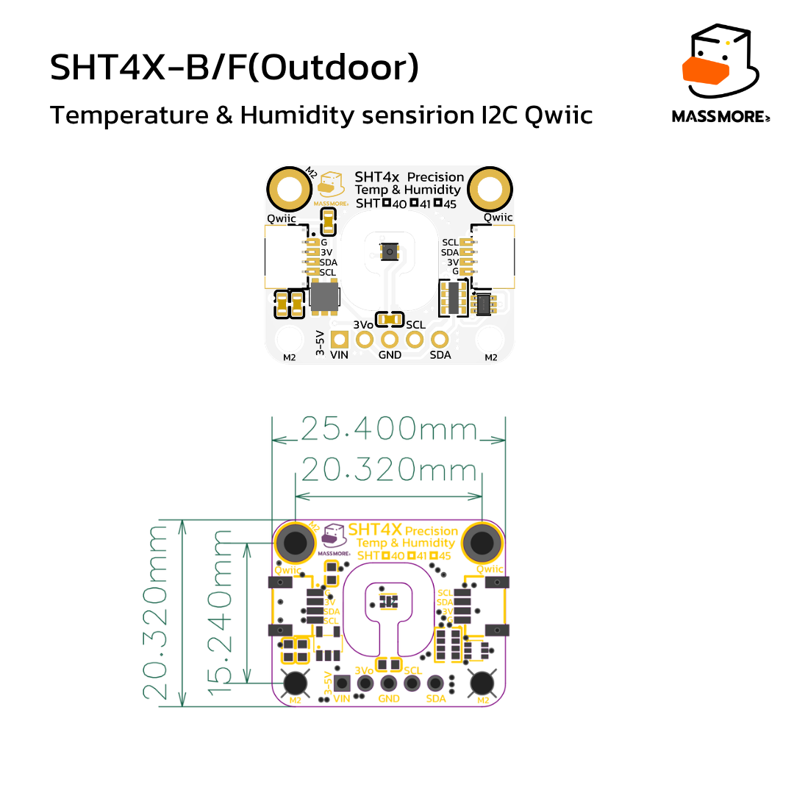
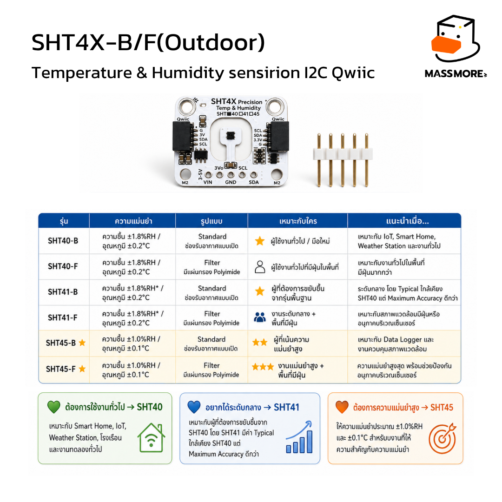
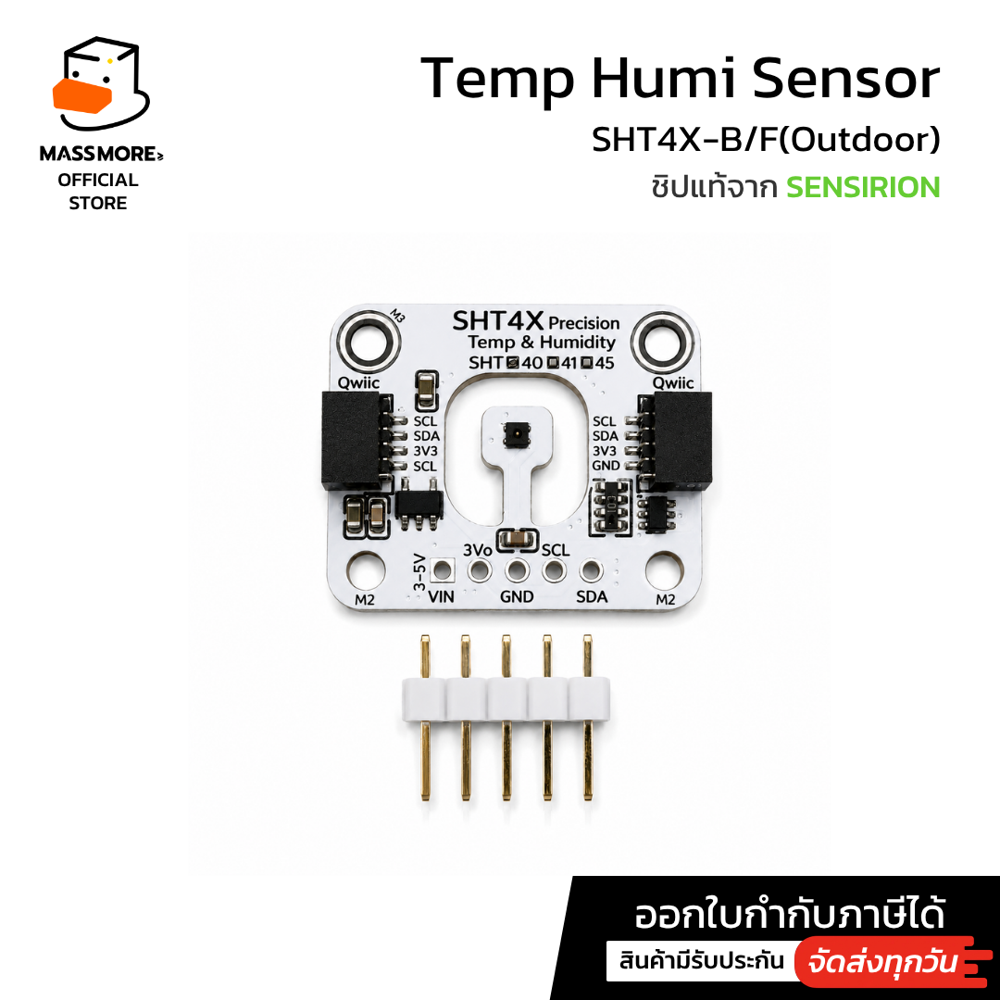
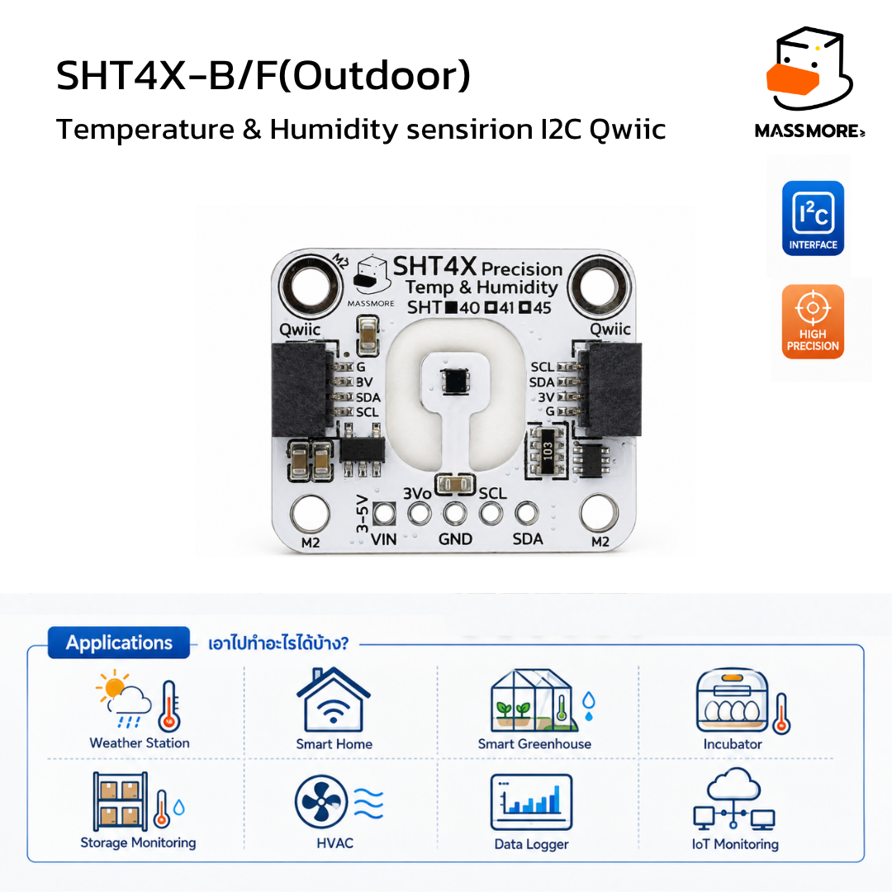

<div align="center">


# Massmore SHT4x

**ไลบรารี Arduino / PlatformIO สำหรับเซ็นเซอร์อุณหภูมิและความชื้น Sensirion SHT4x**

รองรับ SHT40 · SHT41 · SHT45 ทั้งรุ่นปกติ (`-B`) และรุ่นกันฝุ่นเมมเบรน Polyimide (`-F` Outdoor)

[](LICENSE)
[](ArduinoIDE/Massmore_SHT4x/CHANGELOG.md)
[](#ติดตั้งบน-arduino-ide)
[](#ติดตั้งบน-vs-code--platformio)

**SKU-1022** · [ดูสินค้าที่ร้าน Massmore](https://www.massmore.shop)

</div>

---

## สารบัญ

- [ไลบรารีนี้ต่างจากตัวอื่นอย่างไร](#ไลบรารีนี้ต่างจากตัวอื่นอย่างไร)
- [สเปกโดยย่อ](#สเปกโดยย่อ)
- [รุ่นในตระกูล SHT4x](#รุ่นในตระกูล-sht4x)
- [SHT4x ต่างจาก SHT3x อย่างไร](#sht4x-ต่างจาก-sht3x-อย่างไร)
- [การต่อสาย](#การต่อสาย)
- [ติดตั้ง](#ติดตั้ง)
- [เริ่มใช้งานใน 10 บรรทัด](#เริ่มใช้งานใน-10-บรรทัด)
- [ตัวอย่างทั้งหมด](#ตัวอย่างทั้งหมด)
- [คู่มือ API](#คู่มือ-api)
- [ฮีตเตอร์ใช้ยังไงให้ถูก](#ฮีตเตอร์ใช้ยังไงให้ถูก)
- [ตรวจสอบว่าเป็นชิปแท้](#ตรวจสอบว่าเป็นชิปแท้)
- [เฟิร์มแวร์ Factory Test](#เฟิร์มแวร์-factory-test)
- [แก้ปัญหาที่พบบ่อย](#แก้ปัญหาที่พบบ่อย)
- [การทดสอบไลบรารี](#การทดสอบไลบรารี)
- [โครงสร้างโฟลเดอร์](#โครงสร้างโฟลเดอร์)
- [เอกสารอ้างอิง](#เอกสารอ้างอิง)

---

## ไลบรารีนี้ต่างจากตัวอื่นอย่างไร

| หัวข้อ | ไลบรารีนี้ |
|---|---|
| **ที่มาของข้อมูล** | เขียนจาก [Datasheet SHT4x V7.3](https://sensirion.com/media/documents/33FD6951/6A7C10A0/HT_DS_Datasheet_SHT4x_V7.3.pdf) โดยตรง ทุกค่าคงที่มีที่มาระบุไว้ในโค้ด |
| **ความครบของฟังก์ชัน** | ครบทุกคำสั่งที่ชิปมี ทั้งการวัดสามระดับ ฮีตเตอร์ทั้ง 6 โหมด ซีเรียลจากโรงงาน soft reset และ general call |
| **ฮีตเตอร์** | ไลบรารีส่วนใหญ่มีแค่เปิด/ปิด ตัวนี้มีครบ 6 โหมด พร้อม **ตัวกันเผลอ duty cycle** ไม่ให้เผลอยิงเกินที่ datasheet อนุญาต |
| **หน่วยความจำ** | ไม่ใช้ heap เลย ไม่มี `new` / `malloc` / `String` ในส่วนแกน กินแรมประมาณ 70 ไบต์ต่ออ็อบเจกต์ |
| **โหมดไม่บล็อก** | มีทั้ง `startMeasurement()` แบบคุมเอง และ `update()` ที่จัดวงจรให้ทั้งหมด |
| **ตรวจของแท้** | `verifyChip()` ทดสอบพฤติกรรม 10 ข้อ รวมถึงการตรวจว่าชิป **NACK ตอนยังวัดไม่เสร็จ** จริงตาม datasheet ซึ่งของเลียนแบบมักทำไม่ได้ |
| **การรายงานข้อผิดพลาด** | แยกรหัสข้อผิดพลาด 12 แบบ พร้อมคำอธิบายภาษาไทย ไม่ใช่แค่คืน `false` |
| **ทดสอบแล้ว** | ชุดทดสอบ 314 ข้อที่รันบน PC ได้โดยไม่ต้องมีบอร์ด + คอมไพล์ผ่านทุกตัวอย่าง 0 warning ที่ `-Wall -Wextra` |
| **เอกสารในโค้ด** | คอมเมนต์ภาษาไทยทุกฟังก์ชัน อธิบายว่าทำอะไรและควรใช้เมื่อไร |
| **ไม่ชนกับใคร** | ทุกชื่อขึ้นต้นด้วย `Massmore_` ติดตั้งคู่กับไลบรารีเจ้าอื่นได้ |

---

## สเปกโดยย่อ

<div align="center">

</div>

| หัวข้อ | ค่า |
|---|---|
| ชิป | Sensirion SHT40 / SHT41 / SHT45 (ตัวถัง DFN 1.5 × 1.5 mm) |
| อินเทอร์เฟซ | I²C สูงสุด 1 MHz (ไลบรารีตั้งไว้ที่ 100 kHz เพื่อความนิ่ง) |
| I²C address | **0x44** สำหรับบอร์ด Massmore (รุ่น -A) · ชิปรุ่น -B = 0x45 · รุ่น -C = 0x46 |
| ช่วงอุณหภูมิ | −40 ถึง +125 °C |
| ช่วงความชื้น | 0 ถึง 100 %RH |
| ความแม่นยำ | ดูตาราง[รุ่นในตระกูล SHT4x](#รุ่นในตระกูล-sht4x) |
| เวลาที่ใช้วัด | 6.9 ms (สูง) · 3.7 ms (กลาง) · 1.3 ms (ต่ำ) |
| ไฟเลี้ยงชิป | 1.08 – 3.6 V (บอร์ดรับ **VIN 3–5 V** มี regulator ในตัว) |
| กระแสตอนไม่ทำงาน | 80 nA |
| กระแสเฉลี่ย | ~0.4 µA ที่วัดวินาทีละครั้งด้วยความละเอียดต่ำ |
| ฮีตเตอร์ | 200 / 110 / 20 mW · พัลส์ 1 s หรือ 0.1 s · duty cycle ต้องต่ำกว่า 10% |
| ขนาดบอร์ด | 25.40 × 20.32 mm · รูยึด M2 |
| คอนเนกเตอร์ | Qwiic / STEMMA QT สองช่อง (ต่อพ่วงได้) + แถวพิน 5 ขา |

> **ขา `3Vo` เป็นเอาต์พุต 3.3 V จาก regulator บนบอร์ด ห้ามจ่ายไฟเข้าขานี้**
> ให้จ่ายไฟที่ `VIN` เท่านั้น

---

## รุ่นในตระกูล SHT4x

<div align="center">

</div>

### ต่างกันที่ความแม่นยำ

| รุ่น | ความชื้น (typ.) | อุณหภูมิ (typ.) | เหมาะกับ |
|---|---|---|---|
| **SHT40** | ±1.8 %RH | ±0.2 °C | งานทั่วไป IoT, Smart Home, Weather Station |
| **SHT41** | ±1.8 %RH | ±0.2 °C | ระดับกลาง ค่า maximum accuracy ดีกว่า SHT40 |
| **SHT45** | ±1.0 %RH | ±0.1 °C | งานที่ต้องการความแม่นยำสูง Data Logger, ห้องแล็บ |

> SHT40, SHT41 และ SHT45 คือ **ซิลิคอนตัวเดียวกัน** ต่างกันที่เกรดที่โรงงานคัดไว้
> ชิปไม่มีรีจิสเตอร์บอกรุ่น จึงอ่านแยกรุ่นผ่าน I²C ไม่ได้ ทั้งในไลบรารีนี้และไลบรารีใด ๆ
> ให้ดูช่องติ๊กบนซิลค์สกรีน (SHT ☐40 ☐41 ☐45) แล้วบอกไลบรารีเองผ่าน `begin()` หรือ `setVariant()`
> ค่านี้ใช้กำหนดเกณฑ์ความแม่นยำที่รายงานเท่านั้น ไม่มีผลต่อการสื่อสาร

### ต่างกันที่ตัวถัง

<div align="center">

</div>

| ตัวถัง | หน้าเซ็นเซอร์ | เหมาะกับ |
|---|---|---|
| **-B** (Standard) | ช่องเปิดโล่ง | ในอาคาร ตอบสนองเร็วที่สุด |
| **-F** (Filter) | มีเมมเบรน Polyimide ปิดไว้ | ที่มีฝุ่นหรือละอองน้ำ กลางแจ้งใต้ที่กำบัง |

> **เมมเบรนกันฝุ่นไม่ใช่กันน้ำ** ตัวโมดูลทั้งบอร์ดไม่กันน้ำ
> รุ่น -F ตอบสนองช้ากว่ารุ่น -B เล็กน้อยเพราะไอน้ำต้องซึมผ่านเมมเบรน

### เลือกรุ่นไหนดี

<div align="center">

</div>

---

## SHT4x ต่างจาก SHT3x อย่างไร

ถ้าคุณเคยใช้ [Massmore_SHT3x](https://github.com/Massmore/Massmore_SHT3x_SKU-1022) มาก่อน
มีสี่เรื่องที่ต้องรู้ เพราะ API ของสองตัวนี้ไม่เหมือนกันโดยตั้งใจ ให้ตรงกับชิปจริง

| เรื่อง | SHT3x | SHT4x |
|---|---|---|
| **ความยาวคำสั่ง** | 16 บิต (2 ไบต์) เช่น `0x2400` | **1 ไบต์** เช่น `0xFD` |
| **โหมด periodic / ART** | มี | **ไม่มี** ใช้ single shot อย่างเดียว |
| **status register** | มี 16 บิต | **ไม่มีเลย** |
| **ขา ALERT / RST** | มี | **ไม่มี** ชิปไม่มีขาเหล่านี้ |
| **clock stretching** | เลือกได้ | **ไม่รองรับ** ถ้าอ่านก่อนวัดเสร็จ ชิปจะ NACK |
| **ฮีตเตอร์** | เปิด/ปิด ~3.6 mW | **6 โหมด** 200/110/20 mW × 1/0.1 s |
| **สูตรความชื้น** | `100 × S / 65535` | `−6 + 125 × S / 65535` |
| **address** | 0x44 / 0x45 เลือกด้วยขา ADDR | 0x44 / 0x45 / 0x46 **กำหนดจากโรงงาน** เปลี่ยนไม่ได้ |

ผลที่ตามมาในการใช้งานจริง

- SHT4x ไม่มีโหมด periodic แปลว่าโปรแกรมต้องสั่งวัดเองทุกครั้ง
  ไลบรารีมี `update()` กับ `setUpdateInterval()` ช่วยจัดจังหวะให้แล้ว
- ไม่มี status register แปลว่าตรวจของแท้ด้วยวิธีเดิมไม่ได้
  `verifyChip()` ของ SHT4x จึงตรวจจาก **จังหวะเวลาและพฤติกรรม** แทน
- ฮีตเตอร์แรงกว่ามาก (200 mW เทียบกับ 3.6 mW) ใช้ไล่หยดน้ำได้จริง
  แต่ต้องระวัง duty cycle

---

## การต่อสาย

<div align="center">

</div>

### ต่อกับ ESP32

| ขาบนบอร์ด SHT4X | ต่อไปที่ ESP32 | หมายเหตุ |
|---|---|---|
| `VIN` | 3V3 หรือ 5V | บอร์ดมี regulator + level shifter ในตัว |
| `GND` | GND | ต้องร่วม ground เสมอ |
| `SDA` | GPIO 21 | ตัวอย่างทั้งหมดใช้ขานี้ |
| `SCL` | GPIO 22 | ตัวอย่างทั้งหมดใช้ขานี้ |
| `3Vo` | ไม่ต้องต่อ | **เอาต์พุต** 3.3 V ห้ามจ่ายไฟเข้า |

### ต่อกับบอร์ดอื่น

| บอร์ด | VIN | SDA | SCL |
|---|---|---|---|
| ESP32 DevKit | 3V3 | GPIO 21 | GPIO 22 |
| ESP32-S3 | 3V3 | GPIO 8 | GPIO 9 |
| ESP32-C3 | 3V3 | GPIO 8 | GPIO 9 |
| Arduino UNO / Nano | 5V | A4 | A5 |
| Raspberry Pi Pico | 3V3 | GP4 | GP5 |
| บอร์ดที่มี Qwiic | เสียบสาย Qwiic ได้เลย | | |

ถ้าใช้ขาปริยายของบอร์ด ให้ส่ง `-1, -1` ให้ `begin()`

```cpp
sensor.begin(MASSMORE_SHT4X_I2C_ADDR_DEFAULT, MASSMORE_SHT4X_VARIANT_SHT40, -1, -1);
```

### แผนผังขา

<div align="center">

</div>

---

## ติดตั้ง

รีโปนี้แยกเป็นสองโฟลเดอร์ ใช้ซอร์สชุดเดียวกัน เลือกอันที่ตรงกับเครื่องมือของคุณ

```
ArduinoIDE/    <- สำหรับ Arduino IDE (มีไฟล์ .zip ให้เลย)
PlatformIO/    <- โปรเจกต์ PlatformIO ที่เปิดแล้ว build ได้ทันที
```

### ติดตั้งบน Arduino IDE

1. ดาวน์โหลด [`ArduinoIDE/Massmore_SHT4x.zip`](ArduinoIDE)
2. **Sketch → Include Library → Add .ZIP Library...** แล้วเลือกไฟล์นั้น
3. เปิดตัวอย่างจาก **File → Examples → Massmore_SHT4x**

ต้องมี ESP32 board package เวอร์ชัน **3.x** ติดตั้งไว้ก่อน
รายละเอียดเพิ่มเติมอยู่ใน [`ArduinoIDE/README.md`](ArduinoIDE/README.md)

### ติดตั้งบน VS Code + PlatformIO

1. **File → Open Folder** เลือกโฟลเดอร์ [`PlatformIO/`](PlatformIO)
2. คัดลอกตัวอย่างที่ต้องการทับ `src/main.cpp`
3. กด Upload

`platformio.ini` pin platform ไว้ที่ pioarduino `55.03.311` = **Arduino ESP32 core 3.3.11**
เพื่อให้ได้ core สาย 3.x เหมือน Arduino IDE รุ่นล่าสุด และ build ซ้ำได้ผลเดิมเสมอ
รายละเอียดเพิ่มเติมอยู่ใน [`PlatformIO/README.md`](PlatformIO/README.md)

---

## เริ่มใช้งานใน 10 บรรทัด

```cpp
#include <Massmore_SHT4x.h>

MassmoreSHT4x sensor;

void setup() {
  Serial.begin(115200);
  sensor.begin(MASSMORE_SHT4X_I2C_ADDR_DEFAULT, MASSMORE_SHT4X_VARIANT_SHT40, 21, 22);
}

void loop() {
  float t, h;
  if (sensor.measure(&t, &h)) {
    Serial.printf("%.2f C  %.2f %%RH\n", t, h);
  }
  delay(1000);
}
```

---

## ตัวอย่างทั้งหมด

| # | ตัวอย่าง | เนื้อหา |
|---|---|---|
| 01 | [`BasicReading`](ArduinoIDE/Massmore_SHT4x/examples/01_BasicReading) | อ่านค่าแบบสั้นที่สุด สามบรรทัดจบ |
| 02 | [`Precision_Timing`](ArduinoIDE/Massmore_SHT4x/examples/02_Precision_Timing) | เทียบความละเอียดสามระดับ ทั้งเวลาที่ใช้และ noise จริง |
| 03 | [`Heater_AllModes`](ArduinoIDE/Massmore_SHT4x/examples/03_Heater_AllModes) | ฮีตเตอร์ครบทั้ง 6 โหมด และเรื่อง duty cycle |
| 04 | [`SerialNumber_Genuine`](ArduinoIDE/Massmore_SHT4x/examples/04_SerialNumber_Genuine) | ซีเรียลจากโรงงาน และ `verifyChip()` รายข้อ |
| 05 | [`DewPoint_Comfort`](ArduinoIDE/Massmore_SHT4x/examples/05_DewPoint_Comfort) | จุดน้ำค้าง ความชื้นสัมบูรณ์ ดัชนีความร้อน ระดับความสบาย |
| 06 | [`NonBlocking`](ArduinoIDE/Massmore_SHT4x/examples/06_NonBlocking) | อ่านค่าโดยไม่หยุดโปรแกรม สองวิธี |
| 07 | [`MultipleSensors`](ArduinoIDE/Massmore_SHT4x/examples/07_MultipleSensors) | ใช้หลายตัวพร้อมกัน ต่างบัส I²C พร้อมตัวสแกน |
| 08 | [`LowPower_DeepSleep`](ArduinoIDE/Massmore_SHT4x/examples/08_LowPower_DeepSleep) | วัดแล้วหลับ เก็บค่าใน RTC memory |
| 09 | [`ErrorHandling`](ArduinoIDE/Massmore_SHT4x/examples/09_ErrorHandling) | จับข้อผิดพลาดและกู้คืนแบบไล่ระดับ |
| 10 | [`DataLogger_Advanced`](ArduinoIDE/Massmore_SHT4x/examples/10_DataLogger_Advanced) | ตัวกรอง สถิติ สอบเทียบด้วย offset และเอาต์พุต CSV |
| 11 | [`FactoryTest`](ArduinoIDE/Massmore_SHT4x/examples/11_FactoryTest) | ชุดทดสอบโรงงาน 2 ด่านคัดกรอง + 24 หัวข้อ |

ทุกตัวอย่างมีทั้งรูปแบบ `.ino` (Arduino IDE) และ `main.cpp` (PlatformIO)
เนื้อหาเหมือนกันทุกบรรทัด ต่างแค่หัวไฟล์

---

## คู่มือ API

### เริ่มต้นใช้งาน

```cpp
MassmoreSHT4x sensor(&Wire);   // ระบุบัส I2C ได้ ค่าเริ่มต้นคือ &Wire

bool begin(uint8_t address = 0x44,
           massmore_sht4x_variant_t variant = MASSMORE_SHT4X_VARIANT_AUTO,
           int8_t sdaPin = -1, int8_t sclPin = -1,
           uint32_t frequency = 100000);

bool beginWithExistingBus(uint8_t address = 0x44,
                          massmore_sht4x_variant_t variant = MASSMORE_SHT4X_VARIANT_AUTO);

bool isConnected();
void setTimeout(uint16_t milliseconds);

static uint8_t scan(TwoWire *wire, uint8_t *found);   // ลอง 0x44 / 0x45 / 0x46
```

### การวัด

```cpp
bool  measure(float *temperature, float *humidity);
bool  measure(massmore_sht4x_reading_t &reading);
bool  measureWith(massmore_sht4x_precision_t precision, float *t, float *h);

float readTemperature();     // NAN เมื่ออ่านไม่สำเร็จ
float readTemperatureF();
float readHumidity();

void  setPrecision(massmore_sht4x_precision_t precision);   // LOW / MEDIUM / HIGH
massmore_sht4x_precision_t getPrecision();
```

### แบบไม่บล็อก

```cpp
bool startMeasurement();
bool isMeasurementReady();
bool readMeasurement(float *temperature, float *humidity);
bool readMeasurement(massmore_sht4x_reading_t &reading);

bool update();                              // จัดวงจรทั้งหมดให้ เรียกใน loop()
void setUpdateInterval(uint32_t intervalMs);
void setCallback(massmore_sht4x_callback_t callback);
massmore_sht4x_mode_t getMode();
```

### ค่าล่าสุดที่เก็บไว้ (ไม่คุยกับบัส)

```cpp
float    getTemperature();
float    getTemperatureF();
float    getHumidity();
uint16_t getRawTemperature();
uint16_t getRawHumidity();
uint32_t getLastUpdateMs();
const massmore_sht4x_reading_t &getLastReading();
```

### ฮีตเตอร์

```cpp
bool runHeater(massmore_sht4x_heater_t mode, massmore_sht4x_reading_t *reading = nullptr);
bool startHeater(massmore_sht4x_heater_t mode);        // ไม่บล็อก
bool isHeaterDone();
bool removeCondensation(uint8_t pulses = 3, uint32_t restMs = 10000);
bool measureAfterHeating(uint32_t coolDownMs, massmore_sht4x_reading_t &reading);
bool runHeaterSelfTest(massmore_sht4x_heater_t mode, float minRiseC, float *riseOut);

void  setHeaterDutyGuard(bool enabled);   // เปิดไว้เป็นค่าเริ่มต้น
float getHeaterDutyPercent();
uint32_t getHeaterOnTimeMs();
void  resetHeaterStats();

static uint16_t heaterPowerMilliwatt(massmore_sht4x_heater_t mode);
static uint16_t heaterDurationMs(massmore_sht4x_heater_t mode);
static const char *heaterToString(massmore_sht4x_heater_t mode);
```

### ตัวตนของชิป

```cpp
bool     readSerialNumber(uint32_t *serial);   // คำสั่ง 0x89
uint32_t getSerialNumber();

massmore_sht4x_genuine_t verifyChip();
uint16_t getVerifyMask();
uint8_t  getVerifyPassCount();
static const char *getVerifyCheckName(uint8_t index);
static const char *genuineToString(massmore_sht4x_genuine_t result);
```

### ค่าที่คำนวณต่อ (เรียกได้โดยไม่ต้องมีอ็อบเจกต์)

```cpp
static float dewPoint(float temperature, float humidity);
static float absoluteHumidity(float temperature, float humidity);
static float heatIndex(float temperature, float humidity);
static float saturationVaporPressure(float temperature);
static float celsiusToFahrenheit(float celsius);
static float fahrenheitToCelsius(float fahrenheit);
```

### รีเซ็ต การชดเชย และรุ่น

```cpp
bool softReset();          // คำสั่ง 0x94
bool generalCallReset();   // รีเซ็ตทุกอุปกรณ์บนบัส

void  setTemperatureOffset(float offsetCelsius);
void  setHumidityOffset(float offsetPercent);
void  setHumidityClipping(bool enabled);   // ตัดค่าให้อยู่ใน 0-100 %RH

void  setVariant(massmore_sht4x_variant_t variant);
const char *getVariantName();
float getTemperatureAccuracy();
float getHumidityAccuracy();
void  setPackage(massmore_sht4x_package_t package);   // -B หรือ -F
```

### การรายงานข้อผิดพลาด

```cpp
massmore_sht4x_error_t lastError();
const char *lastErrorString();               // ข้อความภาษาไทย
static const char *errorToString(massmore_sht4x_error_t error);
void clearError();
```

| รหัส | ความหมาย | มักเกิดเพราะ |
|---|---|---|
| `OK` | ปกติ | |
| `ERR_NOT_BEGUN` | ยังไม่ได้เรียก `begin()` | ลืมเรียกใน `setup()` |
| `ERR_NO_DEVICE` | ไม่มีอุปกรณ์ตอบ | สายหลุด หรือไม่ได้จ่ายไฟ |
| `ERR_I2C_WRITE` | เขียนลงบัสไม่สำเร็จ | สาย SDA/SCL มีปัญหา |
| `ERR_I2C_READ` | อ่านได้ไบต์ไม่ครบ | ชิปยัง NACK อยู่ หรือสายไม่นิ่ง |
| `ERR_CRC` | checksum ไม่ตรง | สัญญาณรบกวน สายยาวเกิน |
| `ERR_TIMEOUT` | รอเกินเวลา | บัสค้าง |
| `ERR_NOT_READY` | ยังวัดไม่เสร็จ | เรียก `readMeasurement()` เร็วไป (ปกติ) |
| `ERR_WRONG_MODE` | เรียกผิดจังหวะ | สั่งวัดตอนฮีตเตอร์ยังทำงาน |
| `ERR_BAD_ARG` | พารามิเตอร์ผิด | address ไม่ใช่ 0x44/0x45/0x46 |
| `ERR_OUT_OF_RANGE` | ค่านอกช่วง | self test ไม่ผ่านเกณฑ์ |
| `ERR_HEATER_DUTY` | ใช้ฮีตเตอร์ถี่เกิน | ยิงซ้ำเร็วเกินกว่าที่ datasheet อนุญาต |

---

## ฮีตเตอร์ใช้ยังไงให้ถูก

ฮีตเตอร์ของ SHT4x แรงกว่า SHT3x มาก (สูงสุด 200 mW เทียบกับ 3.6 mW)
ใช้ให้ถูกจะช่วยงานได้จริง ใช้ผิดจะทำให้ค่าเพี้ยนถาวร

### ใช้เมื่อไร

| สถานการณ์ | โหมดที่แนะนำ | จังหวะ |
|---|---|---|
| มีหยดน้ำเกาะหน้าเซ็นเซอร์ ค่าค้างที่ 100 %RH | `200MW_1S` | ยิง 3 ครั้ง ห่างกัน 10 วินาที (`removeCondensation()`) |
| อยู่ในที่ชื้นเกิน 90 %RH นาน ๆ กันค่าเลื่อน | `20MW_1S` | ทุก 5–10 นาที |
| เช็คว่าเซ็นเซอร์ยังทำงานอยู่จริง | `200MW_1S` | ตอนบูตครั้งเดียว (`runHeaterSelfTest()`) |
| งานทั่วไปในอาคาร | **ไม่ต้องใช้เลย** | |

### กฎที่ห้ามลืม

1. **ค่าที่ได้จากคำสั่งฮีตเตอร์คือค่าตอนร้อน** อย่าเอาไปรายงานเป็นอุณหภูมิห้อง
   ให้ใช้ `measureAfterHeating()` วัดใหม่หลังพักแล้ว
2. **duty cycle ต้องต่ำกว่า 10%** ยิง 1 วินาทีแล้วต้องพักอย่างน้อย 9 วินาที
   ไลบรารีบังคับให้อัตโนมัติ ปิดได้ด้วย `setHeaterDutyGuard(false)` ถ้ารู้ว่ากำลังทำอะไร
3. **หลังยิงพัลส์ 200 mW เซ็นเซอร์ใช้เวลาราว 3–5 วินาทีจึงกลับสู่อุณหภูมิห้อง**

```cpp
// ตัวอย่างการไล่หยดน้ำแล้ววัดค่าจริง
if (sensor.getHumidity() > 99.0f) {
  sensor.removeCondensation(3, 10000);      // ยิงสามพัลส์ 200 mW
  massmore_sht4x_reading_t settled;
  sensor.measureAfterHeating(5000, settled); // พัก 5 วินาทีแล้ววัดใหม่
}
```

---

## ตรวจสอบว่าเป็นชิปแท้

<div align="center">

</div>

SHT4x ไม่มี status register แบบ SHT3x จึงตรวจของแท้ด้วยวิธีเดิมไม่ได้
`verifyChip()` ของไลบรารีนี้ตรวจจาก **พฤติกรรมและจังหวะเวลา** แทน รวม 10 ข้อ

| # | ข้อตรวจ | ทำไมของปลอมถึงตก |
|---|---|---|
| 1 | ตอบ ACK ที่ address | ไม่มีชิปอยู่จริง |
| 2 | CRC ของซีเรียลถูกทั้งสอง word | ไม่รู้จักคำสั่ง `0x89` |
| 3 | ซีเรียลไม่ใช่ `0x00000000` / `0xFFFFFFFF` | ตอบค่าว่างมาให้ |
| 4 | อ่านซีเรียลซ้ำได้ค่าเดิม | ของที่สุ่มค่าจะตกข้อนี้ |
| 5 | soft reset แล้วยังวัดต่อได้ | ไม่รู้จักคำสั่ง `0x94` |
| 6 | CRC ของผลวัดถูก | คำนวณ CRC-8 ของ Sensirion ไม่ถูก |
| 7 | ค่าที่วัดอยู่ในช่วงที่เป็นไปได้ | ตอบค่าคงที่หรือค่าขยะ |
| 8 | **NACK เมื่อถูกอ่านตอนยังวัดไม่เสร็จ** | **ข้อที่ของปลอมตกบ่อยที่สุด** — ของเลียนแบบที่ทำเป็นตารางค่าคงที่จะตอบทันที |
| 9 | ความละเอียดต่ำวัดเสร็จเร็วกว่าความละเอียดสูงจริง | ไม่ได้วัดจริง จึงใช้เวลาเท่ากันหมด |
| 10 | ปฏิเสธคำสั่งที่ไม่มีในตาราง | ตอบข้อมูลให้ทุกคำสั่ง |

สรุปผล

| ผ่านกี่ข้อ | ผลสรุป |
|---|---|
| 10/10 | `GENUINE_PASS` — ของแท้ Sensirion SHT4x |
| 8–9 | `GENUINE_PARTIAL` — น่าจะแท้ แต่มีบางข้อไม่ผ่าน |
| น้อยกว่า 8 | `GENUINE_SUSPECT` — น่าสงสัย |
| ตกข้อ 2 หรือ 6 | `GENUINE_NOT_SHT4X` — ไม่ใช่ SHT4x แน่นอน |

> **ขอบเขต** นี่คือการตรวจเชิงพฤติกรรมระดับโปรโตคอล **ไม่ใช่ลายเซ็นดิจิทัล**
> ตอบได้ว่า "ชิปตัวนี้ทำตัวเหมือน SHT4x แท้ทุกประการหรือไม่" เท่านั้น
> บอร์ด Massmore ใช้ชิปแท้จาก Sensirion ประกอบในประเทศไทย **by Massmore**

ชิปตระกูลอื่นที่ใช้ address `0x44` เหมือนกัน เช่น SHT3x หรือ AHT2x
จะใช้คำสั่งแบบ 2 ไบต์ จึงตกข้อ 2 กับ 6 ทันทีและถูกจัดเป็น `NOT_SHT4X`

ดูตัวอย่างการใช้งานเต็ม ๆ ที่ [`04_SerialNumber_Genuine`](ArduinoIDE/Massmore_SHT4x/examples/04_SerialNumber_Genuine)

---

## เฟิร์มแวร์ Factory Test

โฟลเดอร์ [`firmware/`](firmware) มีไฟล์ `.bin` ที่ build ไว้แล้ว **แฟลชได้เลยไม่ต้องคอมไพล์**

- ทดสอบ 2 ด่านคัดกรอง + 24 หัวข้อ แล้วสรุปผ่าน/ไม่ผ่านในหน้าเดียว
- รันเองทันทีที่บูต พิมพ์ `r` เพื่อทดสอบซ้ำ ใช้เวลาราว 40 วินาที
- มี `flash_mac.command` สำหรับ macOS ดับเบิลคลิกได้เลย (baud 512000)
- มีบรรทัด `#RESULT` / `#DEVICE` / `#VERDICT` ให้โปรแกรมอื่นอ่านผลอัตโนมัติ

วิธีใช้ทั้งหมด ตัวอย่างผลลัพธ์ และการแก้ปัญหา อยู่ใน [`firmware/README.md`](firmware/README.md)

---

## แก้ปัญหาที่พบบ่อย

<details>
<summary><b>begin() คืน false — ไม่พบเซ็นเซอร์</b></summary>

ไล่ตรวจตามลำดับ

1. **`VIN` ต่อแล้วหรือยัง** — ต่อ 3V3 หรือ 5V ก็ได้ แต่ **ห้ามจ่ายไฟเข้าขา `3Vo`**
2. **`GND` ร่วมกันหรือยัง** — ถ้าจ่ายไฟคนละแหล่ง ต้องเชื่อม GND ถึงกัน
3. **`SDA` กับ `SCL` สลับกันไหม** — ลองสลับดู เสียหายไม่ได้
4. **ขา I²C ตรงกับบอร์ดไหม** — ตัวอย่างตั้งไว้ที่ 21/22 ซึ่งเป็นของ ESP32 DevKit
   บอร์ด S3/C3 ใช้ 8/9 ให้แก้เลขขาหรือส่ง `-1, -1`
5. รันตัวสแกนใน [`07_MultipleSensors`](ArduinoIDE/Massmore_SHT4x/examples/07_MultipleSensors)
   ดูว่าเจออุปกรณ์อะไรบนบัสบ้าง

</details>

<details>
<summary><b>อ่านค่าได้บ้างไม่ได้บ้าง / ERR_CRC เป็นระยะ</b></summary>

เกือบทั้งหมดเป็นปัญหาสายไฟ ไม่ใช่ชิป

1. สาย I²C ยาวเกิน 30 ซม. ให้สั้นลง
2. ลดความถี่บัสลงเหลือ 100 kHz (ค่าเริ่มต้นของไลบรารีอยู่แล้ว)
3. อย่าเดินสายขนานกับสายมอเตอร์ รีเลย์ หรือสายไฟ AC
4. ถ้าต่อพ่วงหลายตัว pull-up รวมอาจต่ำเกินไป ลองถอดตัวอื่นออกก่อน

</details>

<details>
<summary><b>readMeasurement() คืน ERR_NOT_READY ตลอด</b></summary>

SHT4x ไม่รองรับ clock stretching ถ้าอ่านก่อนวัดเสร็จ ชิปจะ NACK ซึ่ง**เป็นพฤติกรรมปกติ**

- ตรวจว่าเรียก `isMeasurementReady()` ก่อนอ่าน
- ถ้าใช้ `update()` ให้เรียกมันบ่อย ๆ ใน `loop()` อย่าเรียกในบล็อกที่มี `delay()` ยาว ๆ

</details>

<details>
<summary><b>runHeater() คืน ERR_HEATER_DUTY</b></summary>

ตัวกันเผลอกำลังทำงานถูกต้องแล้ว datasheet กำหนดว่าฮีตเตอร์ใช้ได้ที่ duty cycle ต่ำกว่า 10%

- ยิงพัลส์ 1 วินาที ต้องพักอย่างน้อย 9 วินาทีก่อนยิงใหม่
- ถ้ารู้ว่ากำลังทำอะไรและต้องการยิงติดกัน ใช้ `setHeaterDutyGuard(false)` ชั่วคราว
- ตรวจ duty ปัจจุบันได้จาก `getHeaterDutyPercent()`

</details>

<details>
<summary><b>อุณหภูมิสูงกว่าความจริง 2-4 องศา</b></summary>

เซ็นเซอร์รับความร้อนจากบอร์ดข้างเคียง โดยเฉพาะ ESP32 ที่เปิด WiFi

1. ย้ายเซ็นเซอร์ออกห่างด้วยสาย Qwiic ยาวหน่อย
2. ถ้าย้ายไม่ได้ ใช้ `setTemperatureOffset()` ชดเชย
   ดูวิธีหาค่า offset ที่ถูกต้องใน [`10_DataLogger_Advanced`](ArduinoIDE/Massmore_SHT4x/examples/10_DataLogger_Advanced) (พิมพ์ `c`)
3. ใช้ความละเอียดต่ำและวัดห่างขึ้น จะลดความร้อนจากตัวชิปเองด้วย

</details>

<details>
<summary><b>ความชื้นค้างที่ 100 %RH ไม่ยอมลง</b></summary>

มีหยดน้ำเกาะอยู่บนหน้าเซ็นเซอร์ ค่าจะไม่ตอบสนองจนกว่าน้ำจะระเหย

```cpp
sensor.removeCondensation(3, 10000);
massmore_sht4x_reading_t settled;
sensor.measureAfterHeating(5000, settled);
```

ถ้าเกิดบ่อยในงานกลางแจ้ง ควรเปลี่ยนไปใช้รุ่น **-F** ที่มีเมมเบรนกันละอองน้ำ

</details>

<details>
<summary><b>ค่าที่วัดได้เพี้ยนหลังอยู่ในที่ชื้นจัดนาน ๆ</b></summary>

เรียกว่า creep เป็นธรรมชาติของเซ็นเซอร์ความชื้นแบบ capacitive ทุกยี่ห้อ
datasheet แนะนำให้ยิงฮีตเตอร์เบา ๆ เป็นระยะ

```cpp
// ทุก 5 นาที เมื่อความชื้นเกิน 90 %RH
sensor.runHeater(MASSMORE_SHT4X_HEATER_20MW_1S, nullptr);
```

</details>

<details>
<summary><b>อยากใช้กับ Arduino UNO / STM32 / RP2040</b></summary>

ใช้ได้ ไลบรารีพึ่งแค่ `Wire` ไม่มีโค้ดเฉพาะ ESP32 ในส่วนแกน
มีสองเรื่องที่ต้องปรับ

1. `begin()` แบบระบุขา SDA/SCL ใช้ได้เฉพาะ ESP32/ESP8266
   บอร์ดอื่นให้ส่ง `-1, -1` แล้วต่อตามขา I²C ตายตัวของบอร์ดนั้น
2. ตัวอย่างที่ 08 ใช้ deep sleep ของ ESP32 บอร์ดอื่นจะ fallback เป็น `delay()` ให้เอง

</details>

---

## การทดสอบไลบรารี

```bash
cd PlatformIO/test
make
```

```
  ผ่าน 314 ข้อ   ไม่ผ่าน 0 ข้อ
```

ชุดทดสอบคอมไพล์ `Massmore_SHT4x.cpp` **ไฟล์เดียวกับที่ลงบอร์ดจริง** โดยแทน `Wire`
ด้วยชิป SHT4x จำลองที่ทำตาม datasheet ทั้งเรื่องคำสั่ง 1 ไบต์ เวลาที่ใช้วัดแต่ละระดับ
และการ NACK ตอนยังวัดไม่เสร็จ ชิปจำลองมีธงให้จำลอง "ของปลอม" หลายแบบ
เพื่อยืนยันว่า `verifyChip()` จับได้จริง

ครอบคลุม: CRC-8 (รวมเวกเตอร์ `CRC(0xBEEF)=0x92` จาก datasheet) · สูตรแปลงค่าทุกจุด ·
ตารางคำสั่งทั้งหมด · `begin()` ทุกกรณี · การวัดทั้งสามระดับ · offset และการตัดขอบ ·
โหมดไม่บล็อก · `update()` และ callback · ฮีตเตอร์ทั้ง 6 โหมด · ตัวกันเผลอ duty cycle ·
ซีเรียลและ `verifyChip()` (ทั้งชิปแท้และชิปปลอม 5 แบบ) · รีเซ็ต · รุ่นและตัวถัง ·
ค่าที่คำนวณต่อ · `scan()` และข้อความข้อผิดพลาดทุกรหัส

นอกจากนี้ [GitHub Actions](.github/workflows/build.yml) จะคอมไพล์ทุกตัวอย่างด้วย
`arduino-cli --warnings all` และตรวจว่าซอร์สสองโฟลเดอร์ตรงกันทุกครั้งที่ push

---

## โครงสร้างโฟลเดอร์

```
Massmore_SHT4x_SKU-1022/
├── README.md                    <- ไฟล์นี้
├── LICENSE                      <- MIT
├── .github/workflows/build.yml  <- CI คอมไพล์ตัวอย่างและรันชุดทดสอบ
├── tools_generate_pio_examples.py
│
├── ArduinoIDE/
│   ├── README.md
│   ├── Massmore_SHT4x.zip       <- สำหรับ Add .ZIP Library
│   └── Massmore_SHT4x/
│       ├── library.properties  keywords.txt  CHANGELOG.md  LICENSE
│       ├── src/                 <- ไลบรารี 3 ไฟล์
│       └── examples/            <- 11 ตัวอย่าง (.ino)
│
├── PlatformIO/
│   ├── README.md  platformio.ini
│   ├── src/main.cpp
│   ├── lib/Massmore_SHT4x/      <- ซอร์สชุดเดียวกับฝั่ง ArduinoIDE
│   ├── examples/                <- 11 ตัวอย่าง (main.cpp)
│   └── test/                    <- ชุดทดสอบ 314 ข้อ + ชิปจำลอง
│
├── firmware/
│   ├── README.md                <- วิธีแฟลช ผลที่ได้ และการแก้ปัญหา
│   └── esp32dev/                <- .bin + manifest.json + SHA256SUMS + สคริปต์แฟลช
│
├── images/                      <- รูปประกอบ
└── docs/                        <- เอกสารเพิ่มเติม
```

---

## เอกสารอ้างอิง

- [Datasheet SHT4x V7.3 — Sensirion](https://sensirion.com/media/documents/33FD6951/6A7C10A0/HT_DS_Datasheet_SHT4x_V7.3.pdf) — แหล่งข้อมูลหลักของไลบรารีนี้
- [Sensirion — Humidity Sensor Handling and Assembly](https://sensirion.com/products/catalog/SHT40) — เรื่อง creep และการดูแลเซ็นเซอร์
- [Massmore_SHT3x_SKU-1022](https://github.com/Massmore/Massmore_SHT3x_SKU-1022) — ไลบรารีพี่น้องสำหรับชิป SHT3x

<div align="center">

</div>

---

## สัญญาอนุญาต

MIT License · Copyright (c) 2026 Massmore Biz Co., Ltd. · ดูรายละเอียดใน [LICENSE](LICENSE)

<div align="center">

**by Massmore**

[ร้านค้า](https://www.massmore.shop) · [ไลบรารี SHT3x](https://github.com/Massmore/Massmore_SHT3x_SKU-1022)

</div>
