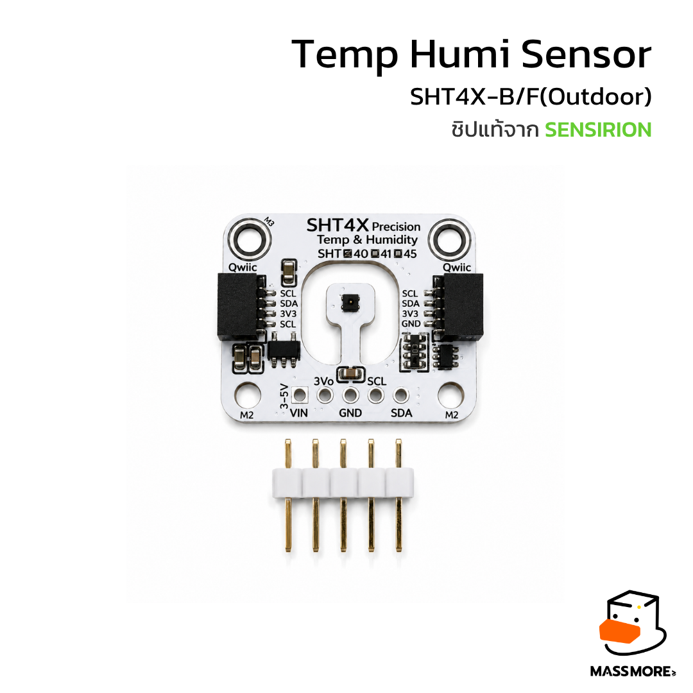
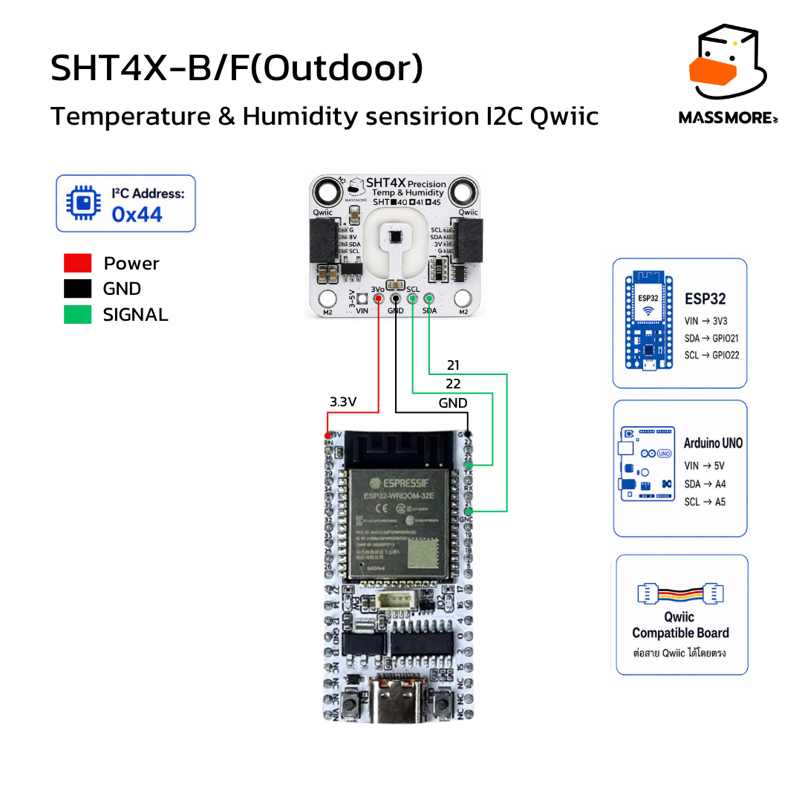

<div align="center">



# เฟิร์มแวร์ Factory Test

**Massmore SHT4X (SKU-1022) · เวอร์ชัน 1.0.0 · สำหรับ ESP32**

ไฟล์ `.bin` พร้อมแฟลช ไม่ต้องคอมไพล์เอง — อัปโหลดแล้วรู้ผลทันทีว่าบอร์ดใช้งานได้จริงหรือไม่

</div>

---

## เฟิร์มแวร์ตัวนี้มีไว้ทำอะไร

ใช้ตรวจบอร์ด SHT4X ว่าทำงานครบทุกฟังก์ชันหรือไม่ ก่อนส่งให้ลูกค้า หรือตอนลูกค้าได้รับของ
แล้วอยากยืนยันว่าบอร์ดปกติดี ทดสอบ **2 ด่านคัดกรอง + 24 หัวข้อ** แล้วสรุปเป็น ผ่าน / ไม่ผ่าน
ให้ในหน้าเดียว

เหมาะกับ

- **ฝ่ายผลิต** — เสียบสาย แฟลช ดูผล ผ่านก็แพ็ค ไม่ผ่านก็คัดออก
- **ลูกค้า** — เช็คว่าบอร์ดที่ได้รับสมบูรณ์ ก่อนเอาไปประกอบเข้างานจริง
- **ตอนหาสาเหตุ** — เมื่อโค้ดของเราอ่านค่าไม่ได้ ใช้ตัวนี้แยกให้ชัดว่าปัญหาอยู่ที่บอร์ดหรือที่โค้ด

---

## สิ่งที่ต้องมี

| รายการ | รายละเอียด |
|---|---|
| บอร์ด MCU | ESP32 (ESP32-WROOM / DevKit / Massmore ESP32 Breakout Board) |
| เซ็นเซอร์ | Massmore SHT4X (SKU-1022) รุ่นใดก็ได้ ทั้ง `-B` และ `-F` |
| สาย | สาย Qwiic หรือสายจัมเปอร์ 4 เส้น |
| สาย USB | ต้องเป็นสายที่ส่งข้อมูลได้ ไม่ใช่สายชาร์จอย่างเดียว |
| ไดรเวอร์ USB-Serial | CP210x หรือ CH34x ตามชิปบนบอร์ด |
| โปรแกรมแฟลช | `esptool` หรือ ESP Web Tools บนเบราว์เซอร์ |

### การต่อสาย

<div align="center">

</div>

| ขา SHT4X | ต่อไปที่ ESP32 | จำเป็นไหม |
|---|---|---|
| `VIN` | 3V3 หรือ 5V | **จำเป็น** |
| `GND` | GND | **จำเป็น** |
| `SDA` | **GPIO 21** | **จำเป็น** |
| `SCL` | **GPIO 22** | **จำเป็น** |
| `3Vo` | ไม่ต้องต่อ | เป็น **เอาต์พุต** 3.3 V ห้ามจ่ายไฟเข้า |

> SHT4x ไม่มีขา ALERT และไม่มีขา RST เหมือน SHT3x จึงต่อแค่สี่เส้นก็ครบแล้ว
> ไม่มีหัวข้อไหนที่ขึ้น WARN เพราะสายไม่ครบ

---

## ไฟล์ในโฟลเดอร์นี้

```
firmware/esp32dev/
├── Massmore_SHT4x_FactoryTest_v1.0.0_esp32dev_merged.bin   <- ใช้ไฟล์นี้ (ไฟล์เดียวจบ)
├── Massmore_SHT4x_FactoryTest_v1.0.0_esp32dev.bin          <- เฉพาะแอป (สำหรับคนที่แฟลชแยกส่วน)
├── bootloader.bin
├── partitions.bin
├── boot_app0.bin
├── flash_mac.command    <- macOS: ดับเบิลคลิกได้เลย
├── flash_linux.sh       <- Linux
├── manifest.json        <- ข้อมูลเฟิร์มแวร์ สำหรับ ESP Web Tools
└── SHA256SUMS.txt       <- ตรวจความถูกต้องของไฟล์
```

### ตำแหน่งการเขียนหน่วยความจำ

| ไฟล์ | Offset |
|---|---|
| `bootloader.bin` | `0x1000` |
| `partitions.bin` | `0x8000` |
| `boot_app0.bin` | `0xe000` |
| `..._esp32dev.bin` | `0x10000` |
| **`..._merged.bin`** | **`0x0`** — รวมทั้งสี่ไฟล์ข้างบนไว้แล้ว |

---

## วิธีอัปโหลด

### วิธีที่ 1 — macOS: ดับเบิลคลิก (ง่ายที่สุด)

1. ติดตั้ง esptool ครั้งเดียว
   ```bash
   pip3 install esptool
   ```
2. เสียบบอร์ด ESP32 เข้ากับ Mac
3. ดับเบิลคลิกไฟล์ `flash_mac.command`

สคริปต์จะหาพอร์ตให้เอง แล้วแฟลชที่ **512000 baud** ซึ่งเป็นความเร็วที่ทดสอบแล้วว่านิ่งที่สุด
กับไดรเวอร์ USB-Serial บน macOS

> ถ้า macOS ขึ้นเตือนว่าเปิดไฟล์ไม่ได้ ให้คลิกขวาที่ไฟล์ แล้วเลือก **Open** หรือสั่ง
> `chmod +x flash_mac.command` ใน Terminal ก่อนหนึ่งครั้ง

### วิธีที่ 2 — พิมพ์คำสั่งเอง (ทุกระบบปฏิบัติการ)

```bash
esptool.py --chip esp32 --port /dev/cu.usbserial-0001 --baud 512000 \
  --before default_reset --after hard_reset \
  write_flash -z --flash_mode dio --flash_freq 40m --flash_size detect \
  0x0 Massmore_SHT4x_FactoryTest_v1.0.0_esp32dev_merged.bin
```

หา port ได้จาก

| ระบบ | คำสั่ง | ตัวอย่างที่ได้ |
|---|---|---|
| macOS | `ls /dev/cu.*` | `/dev/cu.usbserial-0001` |
| Linux | `ls /dev/ttyUSB*` | `/dev/ttyUSB0` |
| Windows | Device Manager → Ports | `COM5` |

### วิธีที่ 3 — แฟลชแยกทีละส่วน

ใช้เมื่อมีเหตุผลเฉพาะ เช่นต้องการเก็บ partition เดิมไว้

```bash
esptool.py --chip esp32 --port <PORT> --baud 512000 write_flash -z \
  0x1000  bootloader.bin \
  0x8000  partitions.bin \
  0xe000  boot_app0.bin \
  0x10000 Massmore_SHT4x_FactoryTest_v1.0.0_esp32dev.bin
```

### ตรวจว่าไฟล์ไม่เสียหายก่อนแฟลช

```bash
shasum -a 256 -c SHA256SUMS.txt     # macOS
sha256sum -c SHA256SUMS.txt         # Linux
```

---

## อัปโหลดแล้วจะเกิดอะไรขึ้น

เฟิร์มแวร์ **เริ่มทดสอบเองทันทีที่บูต** ไม่ต้องกดหรือพิมพ์อะไร

เปิด Serial Monitor ที่ **115200 baud**

```bash
screen /dev/cu.usbserial-0001 115200      # macOS (ออกด้วย Ctrl-A แล้วกด K)
pio device monitor -b 115200              # ถ้ามี PlatformIO
```

### ลำดับการทำงาน

```
บูต  ->  GATE 1 สแกนบัส I2C  ->  GATE 2 ตรวจตัวตนชิป  ->  RUN TEST 24 หัวข้อ  ->  สรุปผล
             |                        |
             ไม่ผ่าน                  ไม่ผ่าน
             |                        |
             +---> พิมพ์สาเหตุที่เป็นไปได้ แล้วหยุด (ไม่เข้า RUN TEST)
```

**ทำไมต้องมีด่านคัดกรองก่อน** — ถ้าหาเซ็นเซอร์ไม่เจอบนบัสเลย การรันอีก 24 หัวข้อก็จะขึ้น
FAIL ทั้งหมดโดยไม่ให้ข้อมูลอะไรเพิ่ม เฟิร์มแวร์จึงหยุดตรงนั้นแล้วบอกสาเหตุที่เป็นไปได้แทน

ทั้งหมดใช้เวลาประมาณ **35 – 45 วินาที** (ส่วนที่นานที่สุดคือการทดสอบฮีตเตอร์ ซึ่งต้อง
เว้นจังหวะพักตามที่ datasheet กำหนด)

### หัวข้อที่ทดสอบทั้งหมด

| # | หัวข้อ | ตรวจอะไร |
|---|---|---|
| 01 | `I2C_SCAN` | สแกน 127 address หา 0x44 / 0x45 / 0x46 |
| 02 | `IDENTITY` | `verifyChip()` 10 ข้อ |
| 03 | `SOFT_RESET` | คำสั่ง `0x94` แล้ววัดต่อได้ |
| 04 | `SERIAL_NUMBER` | คำสั่ง `0x89` อ่านซ้ำได้ค่าเดิม |
| 05 | `CRC_INTEGRITY` | อ่าน 100 ครั้ง นับ CRC ที่ผิด |
| 06 | `MEAS_HIGH` | คำสั่ง `0xFD` ค่าและเวลาที่ใช้ |
| 07 | `MEAS_MEDIUM` | คำสั่ง `0xF6` |
| 08 | `MEAS_LOW` | คำสั่ง `0xE0` |
| 09 | `TIMING_ORDER` | ต่ำ < กลาง < สูง ตามที่ควรเป็น |
| 10 | `NACK_BEHAVIOR` | อ่านที่ 2 ms แล้วชิปต้อง NACK |
| 11 | `NOISE_COMPARE` | sd ของความละเอียดต่ำเทียบกับสูง |
| 12 | `CROSS_PRECISION` | ค่าที่ได้จากสองความละเอียดต้องใกล้กัน |
| 13 | `HEATER_20MW` | ฮีตเตอร์เบา |
| 14 | `HEATER_110MW` | ฮีตเตอร์กลาง |
| 15 | `HEATER_200MW` | ฮีตเตอร์แรง อุณหภูมิต้องขึ้นจริง |
| 16 | `HEATER_DUTY` | ตัวกันเผลอปฏิเสธการยิงถี่เกินจริงไหม |
| 17 | `COOLDOWN` | ค่ากลับสู่ปกติหลังพัก |
| 18 | `BOGUS_CMD` | คำสั่งนอกตารางต้องไม่ถูกตอบ |
| 19 | `GENERAL_CALL` | รีเซ็ตทั้งบัสแล้ววัดต่อได้ |
| 20 | `PLAUSIBILITY` | ค่าสมเหตุสมผล จุดน้ำค้างไม่เกินอุณหภูมิ |
| 21 | `STABILITY` | วัด 20 ครั้ง ค่าต้องไม่แกว่ง |
| 22 | `BUS_SPEED` | ทดสอบที่ 400 kHz และ 100 kHz |
| 23 | `NON_BLOCKING` | วงจร start / ready / read ทำงานถูก |
| 24 | `OFFSET_API` | ใส่ offset แล้วค่าขยับตาม |
| 25 | `CLIPPING_API` | การตัดขอบความชื้นทำงาน |
| 26 | `VARIANT_SPEC` | รายงานสเปกของรุ่นที่ตั้งไว้ |

### ตัวอย่างผลลัพธ์ที่ได้

```
==========================================================
  Massmore SHT4X (SKU-1022) - Factory Test
  Temperature & Humidity Sensor  |  Sensirion SHT4x
==========================================================
  I2C  SDA=GPIO21  SCL=GPIO22

--- GATE 1 : สแกนบัส I2C ---
      พบอุปกรณ์ที่ 0x44
[ OK ] 01 I2C_SCAN           พบ SHT4x ที่ 0x44 (อุปกรณ์บนบัสทั้งหมด 1 ตัว)
#RESULT,1,I2C_SCAN,PASS,พบ SHT4x ที่ 0x44 (อุปกรณ์บนบัสทั้งหมด 1 ตัว)

--- GATE 2 : ตรวจตัวตนของชิป ---
      [ok] 1. ตอบ ACK ที่ address
      [ok] 2. CRC ของซีเรียล
      [ok] 3. ซีเรียลไม่ใช่ค่าว่าง
      [ok] 4. อ่านซีเรียลซ้ำได้ค่าเดิม
      [ok] 5. soft reset แล้ววัดต่อได้
      [ok] 6. CRC ของผลวัด
      [ok] 7. ค่าที่วัดอยู่ในช่วง
      [ok] 8. NACK ตอนยังวัดไม่เสร็จ
      [ok] 9. ความละเอียดต่ำเสร็จเร็วกว่า
      [ok] 10. ปฏิเสธคำสั่งนอกตาราง
[ OK ] 02 IDENTITY           ผ่าน 10/10 ข้อ : ของแท้ Sensirion SHT4x
#RESULT,2,IDENTITY,PASS,ผ่าน 10/10 ข้อ : ของแท้ Sensirion SHT4x

--- RUN TEST ---
[ OK ] 03 SOFT_RESET         0x94 สำเร็จ วัดต่อได้ 29.84 C
[ OK ] 04 SERIAL_NUMBER      0x0A1B2C3D (อ่านซ้ำได้ค่าเดิม)
[ OK ] 05 CRC_INTEGRITY      อ่าน 100 ครั้ง CRC ผิด 0 ครั้ง ผิดอื่น 0 ครั้ง
[ OK ] 06 MEAS_HIGH          29.84 C  58.21 %RH  ใช้เวลา 10842 us
[ OK ] 07 MEAS_MEDIUM        29.85 C  58.19 %RH  ใช้เวลา 6731 us
[ OK ] 08 MEAS_LOW           29.83 C  58.24 %RH  ใช้เวลา 3688 us
[ OK ] 09 TIMING_ORDER       ต่ำ 3688 us  กลาง 6731 us  สูง 10842 us
[ OK ] 10 NACK_BEHAVIOR      อ่านที่ 2 ms แล้วชิป NACK ถูกต้องตาม datasheet
[ OK ] 11 NOISE_COMPARE      sd ต่ำ=0.04 C  sd สูง=0.01 C
[ OK ] 12 CROSS_PRECISION    ต่างกัน 0.02 C และ 0.11 %RH ระหว่างความละเอียดต่ำกับสูง
[ OK ] 13 HEATER_20MW        20 mW  29.84 C -> 29.97 C  ขึ้น 0.13 C
[ OK ] 14 HEATER_110MW       110 mW  29.85 C -> 31.42 C  ขึ้น 1.57 C
[ OK ] 15 HEATER_200MW       200 mW  29.86 C -> 33.11 C  ขึ้น 3.25 C
[ OK ] 16 HEATER_DUTY        ยิงซ้ำทันทีถูกกันไว้ถูกต้อง duty ตอนนี้ 8.42 %
[ OK ] 17 COOLDOWN           หลังพัก 4 วินาที 29.91 C  58.05 %RH
[ OK ] 18 BOGUS_CMD          คำสั่ง 0x77 ไม่ถูกตอบด้วยข้อมูล ถูกต้อง
[ OK ] 19 GENERAL_CALL       รีเซ็ตทั้งบัสแล้ววัดต่อได้ 29.87 C
[ OK ] 20 PLAUSIBILITY       29.87 C  58.14 %RH  จุดน้ำค้าง 21.02 C
[ OK ] 21 STABILITY          20 ครั้ง ช่วง T 0.04 C  ช่วง RH 0.31 %
[ OK ] 22 BUS_SPEED          400 kHz ผ่าน 10/10, 100 kHz ผ่าน 10/10
[ OK ] 23 NON_BLOCKING       วนรอได้ 8421 รอบระหว่างวัด แล้วได้ 29.86 C
[ OK ] 24 OFFSET_API         ใส่ offset -3.00 C แล้วค่าลดลง 3.00 C
[ OK ] 25 CLIPPING_API       เปิดปิดได้ และค่าอยู่ในช่วง 0-100 (58.12 %RH)
[ OK ] 26 VARIANT_SPEC       SHT40 สเปก +/-0.20 C, +/-1.80 %RH

==========================================================
  รายงานสรุป Massmore SHT4X (SKU-1022)
==========================================================

[ อุปกรณ์ที่ตรวจพบ ]
  I2C address     : 0x44
  รุ่นที่ตั้งไว้     : SHT40
  ซีเรียล         : 0x0A1B2C3D
  ผลตรวจของแท้     : ของแท้ Sensirion SHT4x  (10/10)
  ไลบรารีเวอร์ชัน   : 1.0.0

[ สรุป ]
  ผ่าน 26   เตือน 0   ไม่ผ่าน 0

  >>> ผลรวม: ผ่าน  บอร์ดนี้ใช้งานได้ปกติ <<<
==========================================================
#DEVICE,0x44,SHT40,0x0A1B2C3D,ของแท้ Sensirion SHT4x,10
#VERDICT,PASS,26,0,0

พิมพ์ r แล้วกด Enter เพื่อทดสอบซ้ำ
```

> ค่าจริงจะต่างจากนี้ตามอุณหภูมิห้อง ซีเรียลของแต่ละชิป และสายที่ใช้
> ตัวเลขข้างบนเป็นแค่ตัวอย่างรูปแบบ ไม่ใช่ผลจากบอร์ดจริง
> (บรรทัด `#RESULT` ถูกตัดออกจากตัวอย่างตั้งแต่หัวข้อที่ 03 เป็นต้นไปเพื่อให้อ่านง่าย
> แต่ของจริงจะมีทุกหัวข้อ)

### ทดสอบซ้ำโดยไม่ต้องแฟลชใหม่

พิมพ์ **`r`** แล้วกด Enter ใน Serial Monitor จะรันทั้งชุดใหม่อีกครั้ง
สะดวกมากตอนทดสอบบอร์ดทีละหลายตัว — เปลี่ยนบอร์ด แล้วพิมพ์ `r`

---

## อ่านผลอย่างไร

| สัญลักษณ์ | ความหมาย | ต้องทำอะไร |
|:-:|---|---|
| `[ OK ]` | ผ่านตามเกณฑ์ | ไม่ต้องทำอะไร |
| `[WARN]` | ไม่ผ่านเกณฑ์ที่ดีที่สุด แต่**ไม่นับว่าบอร์ดเสีย** | อ่านรายละเอียดประกอบ ส่วนใหญ่เกิดจากสภาพแวดล้อม |
| `[FAIL]` | ทำงานผิดจากที่ datasheet กำหนด | บอร์ดมีปัญหาจริง ให้คัดออกหรือแจ้งเคลม |

**ผลรวมจะเป็น PASS ก็ต่อเมื่อไม่มีหัวข้อไหนขึ้น FAIL เลย** หัวข้อที่เป็น WARN ไม่ทำให้ตก

### หัวข้อที่ขึ้น WARN ได้เป็นเรื่องปกติ

| หัวข้อ | ทำไมถึงขึ้น WARN |
|---|---|
| `HEATER_200MW` | มีลมพัดผ่านแรง หรือชิปติดกับแผ่นโลหะที่ระบายความร้อนเร็ว จึงขึ้นไม่ถึง 0.3 องศา |
| `MEAS_*` / `PLAUSIBILITY` / `COOLDOWN` | ค่าอยู่นอกช่วง 5–55 °C หรือ 5–98 %RH ซึ่งอาจเป็นเพราะทดสอบในห้องเย็นหรือห้องอบจริง ๆ |
| `BUS_SPEED` | 400 kHz ไม่ผ่านเพราะสายยาวเกิน — ที่ 100 kHz ยังใช้งานได้ปกติ |
| `STABILITY` | มีลมพัดหรือคนเดินผ่านตอนทดสอบ |
| `TIMING_ORDER` | บัสช้ามากจนเวลาที่วัดได้ถูกกลบด้วยเวลาสื่อสาร |
| `CROSS_PRECISION` | อุณหภูมิกำลังเปลี่ยนเร็วระหว่างวัดสองครั้ง |
| `IDENTITY` | ผ่าน 8–9 ข้อจาก 10 ให้ดูว่าตกข้อไหน |
| `GENERAL_CALL` | MCU บางรุ่นไม่ยอมส่ง general call ไปที่ address 0x00 |

### บรรทัดสำหรับเครื่องอ่าน

บรรทัดที่ขึ้นต้นด้วย `#` ออกแบบให้โปรแกรมอื่นแยกวิเคราะห์ได้ง่าย

```
#RESULT,<ลำดับ>,<ชื่อหัวข้อ>,<PASS|WARN|FAIL>,<รายละเอียด>
#DEVICE,<address>,<variant>,<serial>,<ผลตรวจของแท้>,<ผ่านกี่ข้อจาก10>
#VERDICT,<PASS|FAIL>,<จำนวนผ่าน>,<จำนวนไม่ผ่าน>,<จำนวนเตือน>
```

ใช้ต่อกับระบบบันทึกผลการผลิต หรือหน้าเว็บทดสอบได้เลย

---

## แก้ปัญหาถ้าใช้งานไม่ได้

### ปัญหาตอนอัปโหลด

<details>
<summary><b>ไม่พบพอร์ต / esptool บอกว่าหา serial port ไม่เจอ</b></summary>

1. เปลี่ยนสาย USB — สายชาร์จอย่างเดียวจะไม่มีเส้นข้อมูล พบบ่อยมาก
2. ติดตั้งไดรเวอร์ USB-Serial ตามชิปบนบอร์ด
   - [CP210x (Silicon Labs)](https://www.silabs.com/developers/usb-to-uart-bridge-vcp-drivers)
   - [CH34x (WCH)](https://www.wch-ic.com/downloads/CH341SER_MAC_ZIP.html)
3. ตรวจว่าเห็นพอร์ตไหม
   ```bash
   ls /dev/cu.*        # macOS
   ls /dev/ttyUSB*     # Linux
   ```
4. บน macOS รุ่นใหม่ ถ้าเพิ่งลงไดรเวอร์ ต้องไปอนุญาตที่
   **System Settings → Privacy & Security** แล้วรีสตาร์ทเครื่อง
5. เสียบพอร์ต USB ตรงที่ตัวเครื่อง อย่าผ่าน USB hub

</details>

<details>
<summary><b>A fatal error occurred: Timed out waiting for packet header</b></summary>

อาการนี้แปลว่าคุยกับบอร์ดได้บ้างแต่ไม่นิ่ง แก้ไล่ตามลำดับ

1. **ลดความเร็ว** — แก้ `BAUD=512000` ในสคริปต์เป็น `460800` แล้วลองใหม่
   ถ้ายังไม่ได้ให้ลด `115200` ซึ่งช้าแต่ผ่านเกือบทุกกรณี
2. **กดปุ่ม BOOT ค้าง** ตอน esptool ขึ้นข้อความ `Connecting.....` แล้วปล่อยเมื่อเริ่มเขียน
   (บอร์ดบางรุ่นวงจร auto-reset ไม่สมบูรณ์)
3. **เปลี่ยนสาย USB** ให้สั้นลง สายยาวเกิน 1 เมตรมักมีปัญหาที่ความเร็วสูง
4. **ถอดอุปกรณ์อื่นที่ต่อขา GPIO 0, 2, 12, 15** ออกก่อนแฟลช

</details>

<details>
<summary><b>Wrong boot mode detected / บอร์ดไม่เข้าโหมดดาวน์โหลด</b></summary>

กด **BOOT** ค้างไว้ แล้วกด **EN/RST** หนึ่งครั้ง จากนั้นปล่อย EN ก่อน แล้วค่อยปล่อย BOOT
บอร์ดจะเข้าโหมดดาวน์โหลด แล้วสั่งแฟลชได้

</details>

<details>
<summary><b>Permission denied ตอนเปิดพอร์ต (Linux)</b></summary>

```bash
sudo usermod -a -G dialout $USER
```

แล้ว **ล็อกเอาต์เข้าใหม่** หรือใช้ `sudo` นำหน้าคำสั่ง esptool ชั่วคราว

</details>

### ปัญหาตอนรัน

<details>
<summary><b>Serial Monitor ไม่ขึ้นอะไรเลย</b></summary>

1. ตั้ง baud rate เป็น **115200** ให้ถูก ถ้าตั้งผิดจะขึ้นเป็นตัวอักษรมั่ว
2. กดปุ่ม **EN/RST** บนบอร์ดหนึ่งครั้ง เพื่อให้บูตใหม่ขณะที่ Serial Monitor เปิดอยู่แล้ว
   (เฟิร์มแวร์รันทันทีตอนบูต ถ้าเปิด monitor ช้า อาจพลาดข้อความไปแล้ว)
3. ปิดโปรแกรมอื่นที่จองพอร์ตอยู่ เช่น Arduino IDE ที่เปิด Serial Monitor ค้างไว้

</details>

<details>
<summary><b>ตัวอักษรไทยขึ้นเป็นสี่เหลี่ยมหรือตัวมั่ว</b></summary>

Serial Monitor ต้องตั้ง encoding เป็น **UTF-8**

- **Arduino IDE** รองรับ UTF-8 อยู่แล้ว
- **PlatformIO Serial Monitor** รองรับอยู่แล้ว
- **PuTTY** ไปที่ Window → Translation → เลือก UTF-8
- **screen** บน macOS รองรับอยู่แล้ว ถ้าเทอร์มินัลตั้ง UTF-8

</details>

<details>
<summary><b>GATE 1 ไม่ผ่าน — "ไม่พบอุปกรณ์บนบัสเลย"</b></summary>

หมายความว่าไม่มีอุปกรณ์ I²C ตัวใดตอบเลยทั้งบัส ไล่ตรวจตามนี้

1. **`VIN` ต่อแล้วหรือยัง** — ต่อกับ 3V3 หรือ 5V ก็ได้ บอร์ดมี regulator ในตัว
   **อย่าจ่ายไฟเข้าขา `3Vo`** เพราะเป็นเอาต์พุต
2. **`GND` ร่วมกันหรือยัง** — ถ้าจ่ายไฟคนละแหล่ง ต้องเชื่อม GND ถึงกัน
3. **`SDA` กับ `SCL` สลับกันหรือเปล่า** — ลองสลับสองเส้นดู เสียหายไม่ได้
4. **สาย Qwiic** — ลองเปลี่ยนเส้นใหม่ หัวคอนเนกเตอร์หลวมพบบ่อย
5. **ถ้าใช้บอร์ด ESP32 รุ่นอื่น** ที่ขา I²C ไม่ใช่ 21/22 เฟิร์มแวร์นี้จะหาไม่เจอ
   ต้องคอมไพล์ตัวอย่าง `11_FactoryTest` ใหม่โดยแก้ `PIN_SDA` / `PIN_SCL`

</details>

<details>
<summary><b>GATE 1 ไม่ผ่าน — "พบ N อุปกรณ์ แต่ไม่มีตัวไหนอยู่ที่ 0x44 0x45 หรือ 0x46"</b></summary>

บัสใช้งานได้ (เพราะเจออุปกรณ์อื่น) แต่ SHT4x ไม่ตอบ

- ดูรายการ address ที่พิมพ์ออกมาก่อนหน้า ว่ามีอะไรบ้าง
- ถ้าไม่มี `0x44` เลย แปลว่าเซ็นเซอร์ไม่ได้รับไฟ หรือชิปเสีย
- ลองวัดแรงดันที่ขา `VIN` และ `3Vo` ของบอร์ดเซ็นเซอร์ด้วยมัลติมิเตอร์
  (`3Vo` ควรอ่านได้ประมาณ 3.3 V เมื่อจ่ายไฟถูกต้อง)

</details>

<details>
<summary><b>GATE 2 ไม่ผ่าน — "ไม่ใช่ SHT4x"</b></summary>

มีอุปกรณ์ตอบที่ `0x44` แต่ไม่ตอบสนองแบบ SHT4x

ดูรายการ 10 ข้อที่พิมพ์ออกมา ข้อที่ขึ้น `[--]` คือข้อที่ตก

- **ตกข้อ 2 กับ 6** (CRC ของซีเรียลและของผลวัด) — เป็นชิปคนละตระกูลแน่นอน
  ชิปที่ใช้ address 0x44 เหมือนกันมีหลายตัว เช่น **SHT3x** หรือ **AHT2x**
  ซึ่งใช้คำสั่งแบบ 2 ไบต์ จึงไม่เข้าใจคำสั่ง 1 ไบต์ของ SHT4x
  ถ้าเป็น SHT3x ให้ใช้ [ไลบรารี Massmore_SHT3x](https://github.com/Massmore/Massmore_SHT3x_SKU-1022) แทน
- **ตกข้อ 8** (NACK ตอนยังวัดไม่เสร็จ) — ข้อนี้ของเลียนแบบตกบ่อยที่สุด
- **ตกเฉพาะข้อ 4** (ซีเรียลไม่คงที่) — สัญญาณไม่นิ่ง ลองสายสั้นลงแล้วพิมพ์ `r`
- **ตกหลายข้อกระจาย** — สายยาวเกินหรือมีสัญญาณรบกวน

บอร์ด Massmore ใช้ชิปแท้จาก Sensirion ถ้าเจอผลนี้กับบอร์ดที่ซื้อจากเรา รบกวนแจ้งเคลมได้เลย

</details>

<details>
<summary><b>CRC_INTEGRITY ขึ้น FAIL</b></summary>

ข้อมูลมาถึงแต่เพี้ยนระหว่างทาง เกือบทั้งหมดเป็นปัญหาสายไฟ ไม่ใช่ชิป

1. สาย I²C ยาวเกิน 30 ซม. ให้สั้นลง
2. อย่าเดินสายขนานไปกับสายมอเตอร์ รีเลย์ หรือสายไฟ AC
3. ตรวจว่า `GND` ต่อแน่นดี ไม่ใช่แค่แตะ ๆ
4. ถ้าต่อพ่วงหลายตัวบนบัสเดียว pull-up รวมอาจต่ำเกินไป ลองถอดตัวอื่นออกก่อน

</details>

<details>
<summary><b>NACK_BEHAVIOR ขึ้น FAIL</b></summary>

หมายความว่าอ่านผลตอน 2 ms หลังสั่งวัดความละเอียดสูงแล้ว **ได้ข้อมูลกลับมา**
ทั้งที่ datasheet ระบุว่าชิปต้อง NACK เพราะยังวัดไม่เสร็จ (ต้องใช้ 6.9 ms)

- เป็นสัญญาณสำคัญว่าอาจไม่ใช่ชิปแท้ ให้ดูผล `IDENTITY` ประกอบ
- ถ้า `IDENTITY` ผ่าน 10/10 แต่ข้อนี้ FAIL ให้พิมพ์ `r` ทดสอบซ้ำอีกครั้ง
  บางครั้งเกิดจากไดรเวอร์ I²C ของ MCU บัฟเฟอร์ข้อมูลเก่าไว้

</details>

<details>
<summary><b>HEATER_200MW ขึ้น WARN — อุณหภูมิขึ้นน้อยเกินไป</b></summary>

ฮีตเตอร์ 200 mW ปกติจะทำให้อุณหภูมิขึ้นหลายองศา ถ้าขึ้นไม่ถึง 0.3 องศา

- ทดสอบในที่ที่ไม่มีลม
- อย่าให้บอร์ดแนบกับแผ่นโลหะหรือฮีตซิงก์
- ถ้าไฟเลี้ยงตกเวลาฮีตเตอร์ทำงาน (200 mW กินราว 60–100 mA) ให้ใช้แหล่งจ่ายที่แรงกว่า
  หรือเสียบ USB ตรงที่เครื่อง ไม่ผ่าน hub

</details>

<details>
<summary><b>HEATER_DUTY ขึ้น FAIL</b></summary>

หัวข้อนี้ทดสอบตรรกะฝั่งไลบรารี ไม่ใช่ตัวชิป ถ้า FAIL แปลว่าตัวกันเผลอไม่ทำงานตามที่คาด
ซึ่งไม่ควรเกิดกับเฟิร์มแวร์ที่แจกไว้ ถ้าเจอกรณีนี้รบกวนแจ้งมาที่ Massmore พร้อมผลเต็ม ๆ

</details>

<details>
<summary><b>STABILITY ขึ้น WARN หรือ FAIL</b></summary>

ค่าที่วัดได้แกว่งเกินเกณฑ์ในเวลาไม่ถึงวินาที

- มีลมพัดผ่าน หรือมีคนเดินผ่านตอนทดสอบ — ย้ายไปที่นิ่ง ๆ แล้วพิมพ์ `r` ทดสอบซ้ำ
- เพิ่งหยิบบอร์ดออกจากมือ ความร้อนจากมือยังคายไม่หมด รอสัก 1 นาที
- เพิ่งผ่านหัวข้อฮีตเตอร์มา ถ้ายังเย็นไม่พอค่าจะไหลลงเรื่อย ๆ
- ถ้าอยู่ในที่นิ่งจริง ๆ แล้วยังแกว่ง ให้ดูหัวข้อ `CRC_INTEGRITY` ประกอบ

</details>

<details>
<summary><b>อยากเปลี่ยนขา GPIO หรือรุ่นของชิป</b></summary>

ต้องคอมไพล์ใหม่ เปิดตัวอย่าง `11_FactoryTest` แล้วแก้ค่าด้านบนของไฟล์

```cpp
#define PIN_SDA 21
#define PIN_SCL 22

#define BOARD_VARIANT MASSMORE_SHT4X_VARIANT_SHT40   // หรือ _SHT41 / _SHT45
```

แล้ว build ตามปกติ ทั้ง Arduino IDE และ PlatformIO

</details>

---

## ข้อมูลการ build

| รายการ | ค่า |
|---|---|
| ซอร์สที่ใช้ | [`11_FactoryTest`](../ArduinoIDE/Massmore_SHT4x/examples/11_FactoryTest) |
| ไลบรารี | Massmore_SHT4x 1.0.0 |
| Platform | pioarduino platform-espressif32 `55.03.311` |
| Arduino ESP32 core | 3.3.11 |
| บอร์ดเป้าหมาย | `esp32dev` (ESP32-WROOM-32, flash 4 MB) |
| Flash mode / freq | dio / 40 MHz |
| Upload speed | 512000 |
| Monitor speed | 115200 |
| ขนาด Flash ที่ใช้ | 326,096 ไบต์ (24.9%) |
| ขนาด RAM ที่ใช้ | 23,636 ไบต์ (7.2%) |
| ผลการคอมไพล์ | 0 error · 0 warning ที่ `-Wall -Wextra` |

สร้างใหม่เองได้ด้วย

```bash
cd PlatformIO
cp examples/11_FactoryTest/main.cpp src/main.cpp
pio run -e esp32dev
# ได้ไฟล์ที่ .pio/build/esp32dev/firmware.factory.bin
```

---

<div align="center">

← [กลับไปหน้าหลักของไลบรารี](../README.md) · [ดูสินค้าที่ร้าน](https://www.massmore.shop)

**by Massmore**

</div>
